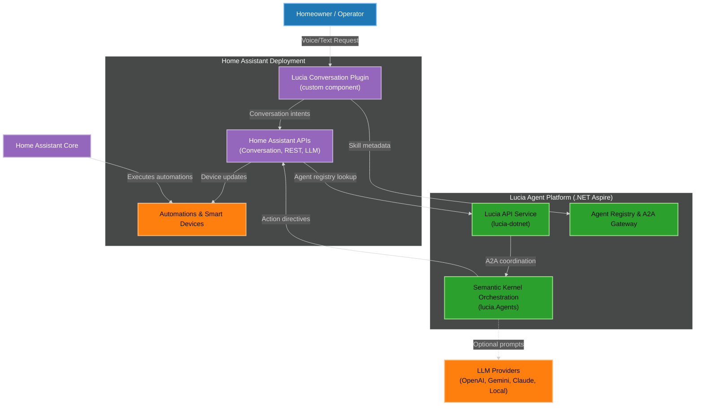
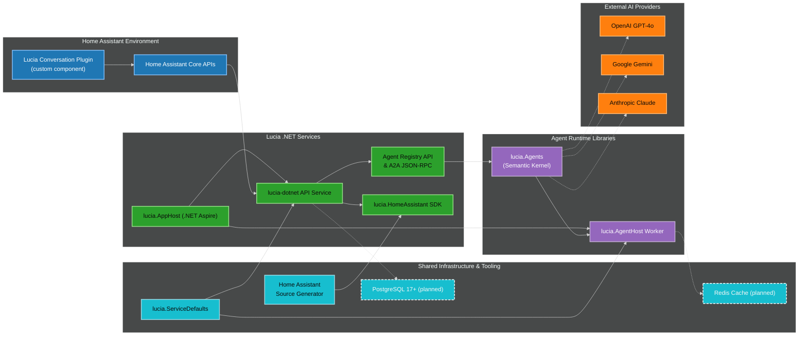
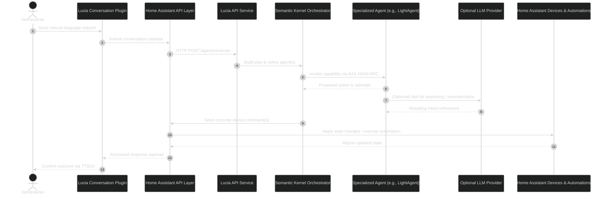
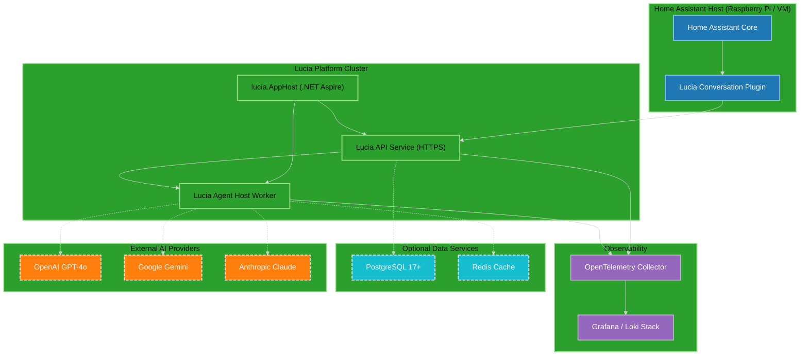

# Architecture Diagram Index

> Created: 2025-10-02  
> Source folder: ./diagrams/

## Diagrams

### 1) System Context
- Purpose: Show the primary actors, system boundaries, and external dependencies for the Lucia platform.
- Source: ./diagrams/context.mmd

### 2) Container View
- Purpose: Break down the Lucia solution into containers, libraries, and key integrations.
- Source: ./diagrams/container.mmd

### 3) Conversation Flow (Sequence)
- Purpose: Document the steps for handling a Home Assistant voice/text request.
- Source: ./diagrams/sequence-conversation-flow.mmd

### 4) Deployment Topology
- Purpose: Illustrate how components are deployed across the home lab and cloud services.
- Source: ./diagrams/deployment.mmd

## Notes

- Dashed connections (`..`) indicate optional or planned integrations.
- All diagrams use accessible, high-contrast palettes for readability on dark backgrounds.
- Update these diagrams when new deployment targets or agents are introduced.
