# Feature Request: Multi-Agent Orchestration

## Feature Description

Implement intelligent multi-agent orchestration using Microsoft Agent Framework 1.0 workflows to enable seamless coordination between specialized agents (LightAgent, MusicAgent, ClimateAgent, etc.). The orchestrator will analyze user requests using semantic understanding and route them to appropriate agents using workflow-based conditional routing patterns.

This feature transforms Lucia from a single-agent selection system to an intelligent multi-agent coordinator that can:
- Automatically determine which agent(s) should handle each request
- Coordinate between multiple agents for complex multi-domain requests  
- Handle conversation handoffs when topics shift between domains
- Provide unified responses that combine capabilities from multiple agents
- Maintain conversation context across agent boundaries

**Key Capabilities:**
1. **Semantic Request Analysis** - LLM-powered intent understanding to classify requests by domain
2. **Dynamic Agent Routing** - Workflow-based conditional edges route requests to appropriate specialized agents
3. **Multi-Agent Coordination** - Support for requests requiring multiple agents working in parallel or sequence
4. **Context Preservation** - Maintain conversation threads and context across agent handoffs using TaskManager with JSON serialization. Store in Redis.
5. **Graceful Fallback** - Handle ambiguous requests and provide helpful responses when no specialized agent matches
6. **Task Durability & Resume** - Persist long-running workflow context in Redis and resume multi-turn conversations after host restarts.

---

## Problem Statement

The current Lucia implementation has significant usability and architectural limitations:

1. **Manual Agent Selection Required**
   - Users must manually select which agent to use via Home Assistant configuration UI
   - No automatic routing based on request content
   - Poor user experience requiring configuration changes to switch agents

2. **No Multi-Domain Request Support**
   - Requests like "Turn on kitchen lights and play jazz music" cannot be handled
   - Single agent selection model prevents agent collaboration
   - Forces users to issue separate commands for multi-domain actions

3. **No Conversation Handoff Capability**
   - When a conversation shifts domains (e.g., lights ? music), the system cannot adapt
   - Context is lost when switching between agents manually
   - Users must reconfigure and restart conversations

4. **Limited Extensibility**
   - Adding new agents doesn't improve the system's intelligence
   - No framework for agents to collaborate or chain operations
   - Orchestration logic is incomplete (NotImplementedException in LuciaOrchestrator)

### Impact on Users

**Home Automation Enthusiasts** are frustrated because:
- "Why do I have to tell it which agent to use? It should just know!"
- Cannot issue natural multi-domain commands
- Experience is worse than basic keyword-based systems

**Developers** cannot:
- Build advanced automation scenarios requiring agent collaboration
- Test multi-agent workflows
- Extend the system with complex orchestration patterns

### Technical Debt

The `LuciaOrchestrator` class exists but has incomplete implementation:
```csharp
throw new NotImplementedException("Orchestration logic not implemented yet");
```

This blocks:
- Phase 2 completion (Core Agent Capabilities)
- Advanced features in Phase 3 (Intelligence & Learning)
- Production readiness and real-world testing

---

## Proposed Solution

Implement a **workflow-based orchestration system** using Microsoft Agent Framework 1.0 with custom executors and conditional routing.

### Architecture Overview

```mermaid
%%{init: {'theme': 'dark', 'themeVariables': { 'primaryColor': '#1b263b', 'primaryBorderColor': '#4cc9f0', 'primaryTextColor': '#f1faee', 'lineColor': '#4cc9f0', 'fontFamily': 'Segoe UI'}}}%%
%% Multi-Agent Orchestration Flow
flowchart TD
   classDef boundary fill:#14213d,stroke:#4cc9f0,color:#f1faee,stroke-width:1px;
   classDef conduit fill:#1a3a4f,stroke:#90e0ef,color:#f1faee,stroke-width:1px;
   classDef core fill:#2a9d8f,stroke:#99d98c,color:#0b090a,stroke-width:1px;
   classDef agent fill:#264653,stroke:#2a9d8f,color:#e9f5db,stroke-width:1px;

   HA["Home Assistant<br/>(User)"]:::boundary
   RPC["JSON-RPC<br/>(A2A Protocol)"]:::conduit

   subgraph Orchestrator["LuciaOrchestrator Workflow"]
      Router["RouterExecutor<br/><small>LLM analysis → AgentChoiceResult</small>"]:::core
      Decision{"Conditional Routing Edges<br/><small>Routes based on agentId<br/>Supports parallel invocation</small>"}:::conduit

      subgraph Wrappers["Agent Wrappers"]
         Light["Light Agent Wrapper"]:::agent
         Music["Music Agent Wrapper"]:::agent
         Climate["Climate Agent Wrapper"]:::agent
         Security["Security Agent Wrapper"]:::agent
      end

      Aggregator["ResultAggregatorExecutor<br/><small>Collect & format responses<br/>Preserve conversation context</small>"]:::core
   end

   HA --> RPC --> Router --> Decision
   Decision -->|Single agent| Light
   Decision --> Music
   Decision --> Climate
   Decision --> Security
   Light --> Aggregator
   Music --> Aggregator
   Climate --> Aggregator
   Security --> Aggregator
   Aggregator --> RPC
   RPC --> HA
```



### Core Components

**1. RouterExecutor**
- Custom executor using `ReflectingExecutor<T>`
- Analyzes user request semantically with LLM
- Queries `AgentRegistry` for available agents and capabilities
- Returns `AgentChoiceResult { agentId, reasoning, confidence }`
- Handle ambiguous requests with clarifying questions

**2. AgentExecutorWrapper**
- Takes a specialized agent as either an AgentCard, AIAgent, or string with the agent id
- Branch:
    - Case `AgentCard`: Uses A2A protocol to call the agent using JSON RPC passing the `taskId` to keep context awareness thru the entire workflow
    - Case `AIAgent`: Calls `AIAgent.RunAsync()` with context preservation
    - Case `agent id`: Use `IServiceProvider` with DI to pull a keyed `AIAgent`, and then call `RunAsync`
- Handles timeouts and errors gracefully
- Emits workflow events for observability

**3. ResultAggregatorExecutor**
- Collects responses from agent(s)
- Formats unified natural language response
- Preserve context for follow-up questions
- Handles partial failures gracefully

**4. LuciaOrchestrator (Updated)**
- Builds workflow with `WorkflowBuilder`
- Initialize workflow with executors
- Configures conditional routing edges
- Executes workflow with user requests
- Manage workflow lifecycle
- Integrates with existing A2A JSON-RPC endpoint

**5. Task-Aware Host Service & Persistence Layer**
- Implements a Redis-backed `ITaskStore` for serializing orchestration context keyed by `taskId`
- Restores persisted state before dispatching requests to the workflow so long-running tasks survive restarts
- Exposes diagnostics (task inspection, forced rehydration) and integrates with `MapA2A` without duplicating `.well-known` handlers

**6. AgentCard Resolver Extension**
- Adds an extension method that converts an `AgentCard` into an `AIAgent`
- Checks the local `AgentCatalog` first to reuse in-process agents, falling back to remote A2A clients when necessary
- Emits telemetry indicating resolution source to aid troubleshooting and capacity planning

### Workflow Execution Flow

1. **User Request Received**
   - Home Assistant sends JSON-RPC request via A2A protocol
   - Request contains: `{ message: "Turn on kitchen lights", taskId: "..." }`

2. **RouterExecutor Analyzes Request**
   - Queries AgentRegistry for available agents
   - Sends request to LLM with agent capabilities
   - LLM returns: `{ agentId: "light-agent", reasoning: "..." }`

3. **Conditional Edge Routes to Agent**
   - Switch-case edge evaluates `AgentChoiceResult`
   - Routes to `light-agent` based on agentId
   - Passes original user message to agent

4. **Agent Processes Request**
   - AgentExecutorWrapper invokes LightAgent
   - Agent uses its skills to control lights
   - Returns: `AgentResponse { success: true, content: "I've turned on..." }`

5. **Aggregator Formats Response**
   - ResultAggregatorExecutor receives agent response
   - Formats for natural language output, ensuring to take into account response length from request
   - Returns final string to workflow `{ message: "I've turned on the kitchen lights.", taskId: "...", ...}`

6. **Response Sent to User**
   - Workflow emits `WorkflowOutputEvent` with final response
   - LuciaOrchestrator extracts and returns string
   - JSON-RPC response sent back to Home Assistant


### Implementation Phases

**Phase 1: Basic Routing (Weeks 1-2)**
- Single-agent routing with conditional edges
- Context preservation across conversation turns
- Integration with existing LightAgent and MusicAgent

**Phase 2: Multi-Agent Coordination (Weeks 3-4)**
- Parallel agent execution with fan-out/fan-in patterns
- Multi-domain request support
- Intelligent response aggregation

**Phase 3: Advanced Features (Weeks 5-6) - Optional**
- Sequential multi-step workflows
- Advanced observability and metrics
- Configuration UI in Home Assistant

### Technical Stack

- **Microsoft.Agents.AI.Workflows** - Workflow orchestration framework
- **Custom Executors** - RouterExecutor, AgentExecutorWrapper, ResultAggregator
- **Conditional Edges** - Switch-case routing based on agent selection
- **AgentRegistry** - Dynamic agent discovery
- **A2A Protocol** - JSON-RPC 2.0 communication

---

## Alternatives Considered

### 1. Simple Coordinator Pattern ?
Direct agent invocation with if/else logic instead of workflows.

**Pros:** Simpler initial implementation  
**Cons:** Not extensible, no observability, reinvents orchestration patterns

**Why Not:** Doesn't align with Agent Framework design patterns, limits future features

### 2. Rule-Based Routing ?
Use keyword matching and regex for routing.

**Pros:** Fast, deterministic, no LLM cost  
**Cons:** Brittle, poor UX, doesn't scale, requires specific keywords

**Why Not:** Contradicts Lucia's semantic understanding value proposition

### 3. Embedding-Based Similarity Search ??
Generate embeddings for agents and requests, use cosine similarity.

**Pros:** Fast inference, lower cost than LLM  
**Cons:** No reasoning, limited flexibility, no clarifications

**Why Not:** Less flexible than LLM routing, but could be added as optimization later

### 4. MagenticOne Pattern ?
Microsoft's purpose-built multi-agent orchestration (not available in Agent Framework 1.0).

**Pros:** Purpose-built for multi-agent coordination  
**Cons:** Not available yet, would block implementation

**Why Not:** Will migrate to MagenticOne when available, but need solution now

---

## Use Cases

### Use Case 1: Single-Domain Request (Basic Routing)

**Scenario:** User wants to control lights

**User Request:**  
> "Turn on the kitchen lights"

**Workflow Execution:**
1. RouterExecutor analyzes: "This is about lighting control"
2. Selects: `light-agent`
3. LightAgent processes request using LightControlSkill
4. Returns: "I've turned on the kitchen lights."

**Expected Result:**  
? Kitchen lights turn on  
? Natural language confirmation  
? Single agent handling

---

### Use Case 2: Multi-Domain Request (Parallel Agents)

**Scenario:** User wants to set up environment for relaxation

**User Request:**  
> "Dim the living room lights to 30% and play some relaxing jazz"

**Workflow Execution:**
1. RouterExecutor analyzes: "This requires both lighting and music"
2. Selects: `["light-agent", "music-agent"]` (Phase 2 enhancement)
3. Both agents execute in parallel
4. ResultAggregator combines responses
5. Returns: "I've dimmed the living room lights to 30% and started playing relaxing jazz."

**Expected Result:**  
? Lights dim to 30%  
? Jazz music starts playing  
? Unified response from orchestrator

---

### Use Case 3: Conversation Handoff (Context Preservation)

**Scenario:** User shifts topic mid-conversation

**Conversation:**

**Turn 1:**  
**User:** "Turn on the bedroom lamp"  
**Lucia:** "I've turned on the bedroom lamp." (via light-agent)

**Turn 2:**  
**User:** "Now play some classical music"  
**Lucia:** "I've started playing classical music in the bedroom." (via music-agent)

**Workflow Execution:**
- Turn 1: RouterExecutor ? light-agent
- Turn 2: RouterExecutor detects topic shift ? music-agent
- Context (location: bedroom) preserved via taskId
- Music agent infers playback location from conversation context

**Expected Result:**  
? Seamless handoff between agents  
? Context preserved (bedroom location)  
? No manual agent switching required

---

### Use Case 4: Ambiguous Request (Clarification)

**Scenario:** User request is unclear or multi-interpretable

**User Request:**  
> "Make it warmer"

**Workflow Execution:**
1. RouterExecutor analyzes: "Could mean lighting (warm color) or climate (temperature)"
2. Agent selection uncertain
3. Returns clarifying question

**Lucia Response:**  
> "Would you like me to adjust the light color temperature to warm white, or increase the heating temperature?"

**User Follow-up:**  
> "The heating"

**Workflow:**
1. RouterExecutor now confident: `climate-agent`
2. ClimateAgent adjusts thermostat

**Expected Result:**  
? System asks for clarification instead of guessing  
? User can specify intent  
? Correct agent handles follow-up

---

### Use Case 5: No Suitable Agent (Fallback)

**Scenario:** User asks about something no specialized agent handles

**User Request:**  
> "What's the weather forecast for tomorrow?"

**Workflow Execution:**
1. RouterExecutor analyzes: "Weather-related request"
2. No weather agent available in registry
3. Selects: `general-assistant` (fallback)
4. General assistant provides helpful response or suggests alternatives

**Lucia Response:**  
> "I don't have access to weather information yet, but you can check the weather in Home Assistant or add a weather integration."

**Expected Result:**  
? Graceful fallback instead of error  
? Helpful response  
? Extensibility path suggested

---

### Use Case 6: Sequential Multi-Step Request (Future)

**Scenario:** User wants a complex automation sequence

**User Request:**  
> "I'm going to bed"

**Workflow Execution (Phase 3):**
1. RouterExecutor: Multi-step orchestration needed
2. Sequential execution:
   - LightAgent: Turn off downstairs lights
   - SecurityAgent: Arm alarm system
   - ClimateAgent: Set bedroom to sleep temperature
   - LightAgent: Dim bedroom lamp
3. ResultAggregator: Summarize all actions

**Expected Result:**  
? Multiple agents coordinate in sequence  
? Complex automation executed automatically  
? Single natural language command


---

## Priority

**High - Blocking my workflow**

**Rationale:**
- Blocks Phase 2 completion (Core Agent Capabilities)
- Essential for production readiness
- Core to Lucia's value proposition
- Competitive parity with commercial voice assistants
- Required for positive user experience

---

## Additional Context

### Integration with Existing System

- **No changes needed** to Home Assistant custom component for Phase 1
- Builds on existing `AgentRegistry` and `AgentCatalog` infrastructure
- Compatible with A2A Protocol v0.3.0 (JSON-RPC 2.0)
- Works with existing `LightAgent` and `MusicAgent` implementations, and should be agent agnostic, allowing
    for integration with any A2A compatible Agent.
- Preserves `threadId` for conversation threading

### Performance Targets

| Metric | Target | Critical |
|--------|--------|----------|
| Total Response Time | < 2s (p95) | < 5s (p99) |
| Router Decision | < 500ms (p95) | < 1s (p99) |
| Workflow Overhead | < 50ms (p95) | < 100ms (p99) |
| Concurrent Requests | 10+ | 5 minimum |

### Dependencies

**Framework:**
- Microsoft.Agents.AI.Workflows 1.0.0+ ? Already added
- Microsoft.Extensions.AI 9.0.0+ ? Already added

**Internal:**
- AgentRegistry ? Implemented
- AgentCatalog ? Implemented
- LightAgent ? Implemented
- MusicAgent ? Implemented

**External:**
- OpenAI API (for router LLM inference) ? Configured
- Home Assistant API ? Integrated

### Risks and Mitigations

**Risk: Router LLM Latency**  
Mitigation: Use fast model (gpt-4o-mini), implement caching, add timeout fallback

**Risk: Router Misclassification**  
Mitigation: Log reasoning, confidence threshold, feedback mechanism

**Risk: Workflow Complexity**  
Mitigation: Comprehensive tests, clear separation of concerns, documentation

**Risk: Context Memory Growth**  
Mitigation: Conversation size limits, context cleanup, memory monitoring

### Observability

- OpenTelemetry tracing for workflow execution
- Custom metrics for routing decisions and agent performance
- Detailed logging with reasoning for debugging
- Agent selection distribution tracking

### Future Enhancements

- Learning from routing corrections
- User-specific routing preferences
- MagenticOne migration when available
- Voice-optimized routing

### References

- [Full Technical Specification](.docs/specs/2025-01-07-multi-agent-orchestration/spec.md)
- [Microsoft Agent Framework Workflows Docs](https://learn.microsoft.com/en-us/agent-framework/user-guide/workflows/)
- [Lucia Roadmap - Phase 2](../../product/roadmap.md#phase-2-core-agent-capabilities-in-progress)
- [A2A Protocol Specification](https://github.com/a2aproject/A2A)

---

## Acceptance Criteria

- [ ] RouterExecutor correctly selects appropriate agent for single-domain requests
- [ ] Agents execute successfully and return natural language responses  
- [ ] Context (taksId) preserved across conversation turns
- [ ] Conversation handoffs work seamlessly between agents
- [ ] Multi-domain requests route to multiple agents (Phase 2)
- [ ] Error handling provides graceful fallbacks
- [ ] Performance meets targets (< 2s p95)
- [ ] Comprehensive test coverage (>85%)
- [ ] Documentation and examples complete

---

**Created:** 2025-01-07  
**Feature ID:** LUCIA-ORCH-001  
**Target Release:** Phase 2 - Core Agent Capabilities  
**Estimated Effort:** Medium (M) - 4-6 weeks  
**Status:** Approved

## Detailed Task Docs:

- [Tasks](.docs/specs/2025-01-07-multi-agent-orchestration/tasks.md)
- [Technical Specs](.docs/specs/2025-01-07-multi-agent-orchestration/tech-specs.md)
- [Business Specs](.docs/specs/2025-01-07-multi-agent-orchestration/spec.md)
- [API Spec](.docs/specs/2025-01-07-multi-agent-orchestration/sub-specs/api-spec.md)
- [Tests Spec](.docs/specs/2025-01-07-multi-agent-orchestration/sub-specs/tests.md)
