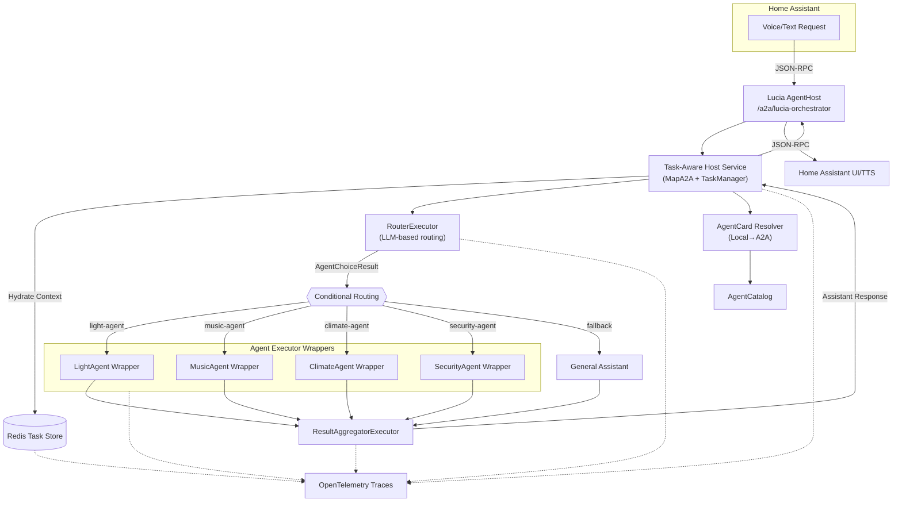

# Technical Specification

This is the technical specification for the spec detailed in @.docs/specs/2025-01-07-multi-agent-orchestration/spec.md

> Created: 2025-10-09  
> Version: 1.0.0

## Technical Requirements

- Implement a `RouterExecutor` that consumes the Microsoft Agent Framework workflow runtime, queries the agent registry, and emits structured `AgentChoiceResult` events with confidence and reasoning metadata.
- Provide reusable `AgentExecutorWrapper` components that encapsulate existing agents, manage conversation thread state, propagate telemetry, and degrade gracefully when downstream skills fail or time out.
- Add a `ResultAggregatorExecutor` that can handle single or multiple agent responses, merge partial results, and surface error context without losing successful actions.
- Extend `LuciaOrchestrator` to build a workflow graph with switch-case routing edges, fan-out/fan-in patterns, and resilience policies controlled via configuration.
- Instrument orchestration with OpenTelemetry spans, metric counters, and structured logs so operators can observe routing confidence, agent latency, and failure rates.
- Deliver a Redis-backed implementation of `ITaskStore` that serializes orchestration context payloads by `taskId`, supports TTL cleanup, and exposes operational metrics.
- Create a task-aware host service that wires A2A message delivery into the workflow `TaskManager`, restores persisted context, and gracefully handles long-running execution.
- Provide an `AgentCard` resolver extension that first checks the local `AgentCatalog` for direct agent instances before constructing an A2A remote client, preserving compatibility with existing `MapA2A` extensions.
- Expose configuration knobs (feature flags, concurrency limits, routing thresholds) through `appsettings` and ensure safe defaults that align with roadmap performance targets (<2s p95 response time).

## Approach Options

**Option A: Workflow-Orchestrated Routing (Selected)**
- Pros: Aligns with Microsoft Agent Framework guidance, promotes reusable executors, gives first-class observability, and makes multi-agent expansion straightforward.
- Cons: Requires deeper familiarity with workflow APIs and adds initial implementation overhead.

**Option B: Lightweight Coordinator Service**
- Pros: Faster to bootstrap with direct service calls and simple branching logic; fewer framework concepts to learn.
- Cons: Harder to scale to multi-agent scenarios, lacks workflow introspection, duplicates resilience features, and risks tight coupling between orchestrator and agents.

**Architecture Diagram:**

## External Dependencies

- **Microsoft.Agents.AI.Workflows (>=1.0.0)** – Provides the workflow runtime, builder primitives, and `ReflectingExecutor` base classes for orchestrator components.
- **Microsoft.Extensions.AI (>=9.0.0)** – Supplies the `IChatClient` abstraction used by the router to invoke LLMs for semantic routing decisions.
- **Lucia Agent Registry Service** – Existing internal service that advertises available agents and their capabilities for inclusion in routing prompts.
- **OpenAI GPT-4o-mini Endpoint** – Preferred hosted LLM for routing prompts, chosen for latency and reasoning balance; alternatives must meet the same JSON response contract.
- **OpenTelemetry Collector** – Aggregates traces, metrics, and logs to surface orchestration performance and reliability insights.
- **Redis 7.x** – Durable store for task context implementing `ITaskStore`; deployed within the existing infrastructure cluster with persistence enabled.
- **StackExchange.Redis** – .NET client library used to manage connections, serialization pipelines, and health checks for the Redis task store.
- **AgentCatalog Service** – Existing component reused by the agent card resolver extension to detect local availability before falling back to remote A2A calls.
