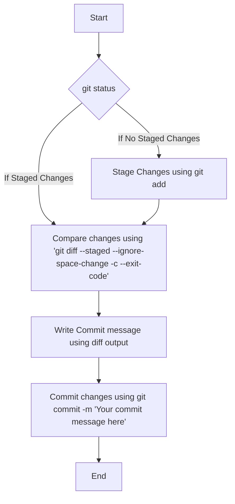

Write a commit message for the current changes in the workspace. Use the [conventional-commits](../instructions/commit-message.instructions.md) specification. 

Process flow:

```mermaid
graph TD;
    A[Start] --> B{git status};
    B -- If Staged Changes --> D;
    B -- If No Staged Changes --> C[Stage Changes using git add];
    C --> D;
    D[Compare changes using 'git diff --staged --ignore-space-change -c --exit-code'] --> E;
    E[Write Commit message using diff output] --> F;
    F[Commit changes using git commit -m 'Your commit message here'] --> G;
    G[End];
```