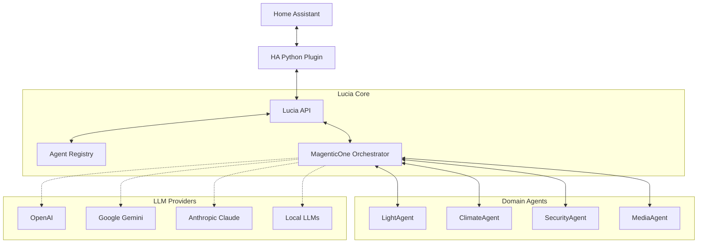

# Lucia - Autonomous Home Assistant AI

[](https://dotnet.microsoft.com/)
[](https://github.com/microsoft/semantic-kernel)
[](LICENSE)
[](https://www.home-assistant.io/)

Lucia is an open-source, privacy-focused AI assistant that serves as a complete replacement for Amazon Alexa and Google Home. Built on Microsoft Semantic Kernel with a multi-agent architecture, Lucia provides autonomous whole-home automation management through deep integration with Home Assistant.

## 🎯 Key Features

- **🤖 Multi-Agent Architecture** - Specialized agents for different domains (lighting, climate, security) that collaborate using MagenticOne orchestration
- **🧠 Semantic Understanding** - Natural language processing using embeddings and semantic search, no rigid command structures
- **🔒 Privacy First** - Fully local operation with optional cloud LLM support, your data stays yours
- **🏠 Deep Home Assistant Integration** - Native integration via LLM API, Conversation API, REST API, and WebSocket
- **📦 Kubernetes Ready** - Cloud-native deployment with .NET Aspire, designed for home lab clusters
- **🔌 Extensible** - Easy to add new agents and capabilities with standardized A2A protocol

## 🚀 Quick Start

### Prerequisites

- .NET 9 SDK or later
- Home Assistant instance (2024.1 or later)
- Docker (optional, for containerized deployment)
- OpenAI API key (or other LLM provider)

### Installation

1. **Clone the repository**
   ```bash
   git clone https://github.com/seiggy/lucia-dotnet.git
   cd jarvis-dotnet/lucia-dotnet
   ```

2. **Configure your settings**
   ```bash
   # Copy the example configuration
   cp appsettings.Development.json.example appsettings.Development.json
   
   # Edit with your Home Assistant URL and API key
   # Add your OpenAI API key or other LLM provider credentials
   ```

3. **Run the application**
   ```bash
   # Using .NET Aspire (recommended for development)
   dotnet run --project lucia.AppHost
   
   # Or run the API directly
   dotnet run --project lucia-dotnet
   ```

4. **Access the services**
   - API: http://localhost:5211
   - Swagger UI: http://localhost:5211/swagger
   - Health Check: http://localhost:5211/health

## 🏗️ Architecture



## 📁 Project Structure

```
lucia-dotnet/
├── lucia-dotnet/           # Main Web API application
├── lucia.Agents/           # Agent implementations and orchestration
├── lucia.AppHost/          # .NET Aspire orchestrator
├── lucia.HomeAssistant/    # Home Assistant API client
├── lucia.HomeAssistant.SourceGenerator/  # Roslyn code generator
├── lucia.ServiceDefaults/  # Shared services and configuration
├── lucia.Tests/            # Unit and integration tests
└── custom_components/lucia/  # Home Assistant Python plugin
```

## 🔧 Configuration

### Environment Variables

```bash
# LLM Configuration
OPENAI_API_KEY=your-api-key
OPENAI_MODEL=gpt-4o
OPENAI_EMBEDDING_MODEL=text-embedding-3-small

# Home Assistant
HOMEASSISTANT_URL=http://your-ha-instance:8123
HOMEASSISTANT_TOKEN=your-long-lived-token

# Lucia Settings
LUCIA_API_URL=http://localhost:5211
LUCIA_AGENT_DISCOVERY_INTERVAL=300
```

### Home Assistant Integration

1. Copy the `custom_components/lucia` folder to your Home Assistant `custom_components` directory
2. Restart Home Assistant
3. Add Lucia integration via UI: Settings → Devices & Services → Add Integration → Lucia
4. Configure the API endpoint and authentication

## 🤝 Agent Registry

Lucia uses a dynamic agent registry system. Agents can register themselves and be discovered by other agents:

```bash
# List all registered agents
GET /api/agents

# Register a new agent
POST /api/agents
{
  "id": "climate-agent",
  "name": "Climate Control Agent",
  "capabilities": ["temperature", "hvac", "humidity"],
  "endpoint": "http://climate-agent:8080"
}
```

## 🧪 Development

### Building from Source

```bash
# Build the entire solution
dotnet build

# Run tests
dotnet test

# Run with hot reload
dotnet watch --project lucia-dotnet
```

### Adding a New Agent

1. Create a new class inheriting from `AgentBase` in `lucia.Agents/Agents/`
2. Implement required methods: `ExecuteAsync`, `GetCapabilities`
3. Register the agent in `Program.cs`
4. Add agent-specific plugins if needed

Example:
```csharp
public class SecurityAgent : AgentBase
{
    public override async Task<string> ExecuteAsync(string request)
    {
        // Agent implementation
    }
    
    public override AgentCapabilities GetCapabilities()
    {
        return new AgentCapabilities
        {
            Domain = "security",
            Actions = ["arm", "disarm", "check_status"]
        };
    }
}
```

## 🐳 Docker Deployment

```bash
# Build the Docker image
docker build -t lucia:latest .

# Run with Docker Compose
docker-compose up -d

# Or deploy to Kubernetes
kubectl apply -f k8s/
```

## 📊 Monitoring

Lucia includes OpenTelemetry instrumentation for comprehensive observability:

- **Metrics**: Request rates, response times, agent performance
- **Traces**: Distributed tracing across agent calls
- **Logs**: Structured logging with correlation IDs

Configure your OTLP endpoint:
```bash
OTEL_EXPORTER_OTLP_ENDPOINT=http://your-collector:4317
```

## 🗺️ Roadmap

### Phase 1: Foundation (Current)
- ✅ Agent Registry
- ✅ LightAgent implementation
- ✅ A2A Protocol
- 🔄 Home Assistant Python plugin
- ⏳ WebSocket integration

### Phase 2: Core Agents
- ⏳ ClimateAgent
- ⏳ SecurityAgent
- ⏳ MediaAgent
- ⏳ Conversation endpoints

### Phase 3: Intelligence
- ⏳ Pattern recognition
- ⏳ Multi-LLM support
- ⏳ Local LLM integration

See [.agent-os/product/roadmap.md](.agent-os/product/roadmap.md) for detailed roadmap.

## 🤝 Contributing

We welcome contributions! Please see our [Contributing Guide](CONTRIBUTING.md) for details.

1. Fork the repository
2. Create a feature branch (`git checkout -b feature/amazing-feature`)
3. Commit your changes (`git commit -m 'Add amazing feature'`)
4. Push to the branch (`git push origin feature/amazing-feature`)
5. Open a Pull Request

## 📄 License

This project is licensed under the MIT License - see the [LICENSE](LICENSE) file for details.

## 🙏 Acknowledgments

- [Microsoft Semantic Kernel](https://github.com/microsoft/semantic-kernel) - AI orchestration framework
- [Home Assistant](https://www.home-assistant.io/) - Open source home automation platform
- [.NET Aspire](https://learn.microsoft.com/en-us/dotnet/aspire/) - Cloud-native app development
- [MagenticOne](https://www.microsoft.com/en-us/research/articles/magentic-one-a-generalist-multi-agent-system-for-solving-complex-tasks/) - Multi-agent orchestration patterns

## 📞 Support

- **Documentation**: [Wiki](https://github.com/seiggy/jarvis-dotnet/wiki)
- **Issues**: [GitHub Issues](https://github.com/seiggy/jarvis-dotnet/issues)
- **Discussions**: [GitHub Discussions](https://github.com/seiggy/jarvis-dotnet/discussions)

---

**Built with ❤️ for the Home Assistant community**
