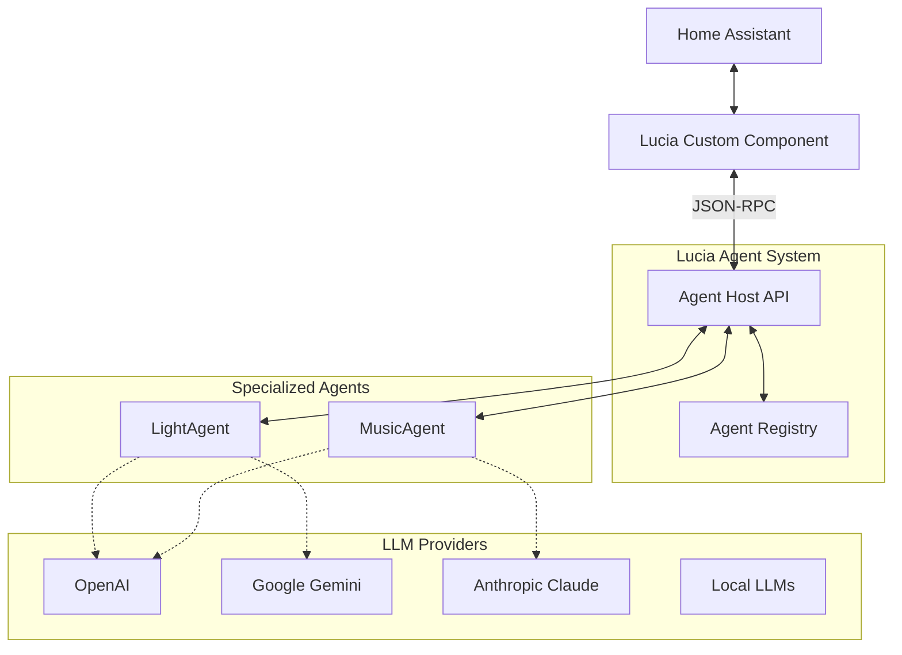

<p align="center">

</p>

# Lucia - Autonomous Home Assistant AI

[](https://dotnet.microsoft.com/)
[](https://github.com/microsoft/semantic-kernel)
[](LICENSE)
[](https://www.home-assistant.io/)


Lucia *(pronounced LOO-sha)* is an open-source, privacy-focused AI assistant that serves as a complete replacement for Amazon Alexa and Google Home. Built on Microsoft Agent Framework with a multi-agent architecture, Lucia provides autonomous whole-home automation management through deep integration with Home Assistant.

## ☀️ About the Name

Lucia is named after **Lucia**, the ancient Nordic sun goddess associated with light, wisdom, and bringing illumination during the darkest time of year. In Norse mythology, Lucia represents the return of light and the power to guide through darkness—a fitting name for an AI assistant that brings intelligent automation and insight to your home.

The name is pronounced **LOO-sha** (or **LOO-thee-ah** in traditional Nordic pronunciation), with the emphasis on the first syllable. The celebration of St. Lucia Day (December 13th) in Scandinavian countries honors this tradition of bringing light and warmth during the winter solstice.

## 🎯 Key Features

- **🤖 Multi-Agent Architecture** - Specialized agents for different domains (lighting, climate, security, media) that collaborate using the A2A (Agent-to-Agent) protocol
- **🧠 Semantic Understanding** - Natural language processing using embeddings and semantic search—no rigid command structures required
- **🔒 Privacy First** - Fully local operation with optional cloud LLM support; your data stays yours
- **🏠 Deep Home Assistant Integration** - Native integration via custom component with agent selection, conversation API, and JSON-RPC communication
- **📦 Kubernetes Ready** - Cloud-native deployment with .NET Aspire, designed for home lab clusters
- **🔌 Extensible** - Easy to add new agents and capabilities with standardized A2A protocol
- **🎭 Dynamic Agent Selection** - Switch between specialized agents (light control, music, etc.) without reconfiguring
- **💬 Conversation Threading** - Context-aware conversations with proper message threading support

## 🚀 Quick Start

### Prerequisites

- .NET 10 RC1 or later
- Home Assistant instance (2024.1 or later)
- HACS (Home Assistant Community Store) for easy installation
- Docker (optional, for containerized deployment)
- OpenAI API key (or other LLM provider)

### Installation

1. **Clone the repository**
   ```bash
   git clone https://github.com/seiggy/lucia-dotnet.git
   cd lucia-dotnet
   ```

2. **Configure your settings**
   ```bash
   # Edit appsettings.Development.json with your settings
   # Add your Home Assistant URL and long-lived access token
   # Add your OpenAI API key or other LLM provider credentials
   ```

3. **Run the application**
   ```bash
   # Using .NET Aspire (recommended for development)
   dotnet run --project lucia.AppHost
   
   # Or run the AgentHost directly
   dotnet run --project lucia.AgentHost
   ```

4. **Install Home Assistant Integration**

   **Option A: HACS (Recommended)**
   ```bash
   # In Home Assistant:
   # 1. Go to HACS → Integrations
   # 2. Click the three dots menu (top right) → Custom repositories
   # 3. Add repository URL: https://github.com/seiggy/lucia-dotnet
   # 4. Select category: Integration
   # 5. Click "Add"
   # 6. Find "Lucia" in HACS and click "Download"
   # 7. Restart Home Assistant
   # 8. Add integration: Settings → Devices & Services → Add Integration → Lucia
   ```

   **Option B: Manual Installation**
   ```bash
   # Copy the custom component to your Home Assistant
   cp -r custom_components/lucia /path/to/homeassistant/custom_components/
   
   # Restart Home Assistant
   # Then add the integration via UI: Settings → Devices & Services → Add Integration → Lucia
   ```

5. **Access the services**
   - Agent API: https://localhost:7235
   - Agent Catalog: https://localhost:7235/agents
   - Swagger UI: https://localhost:7235/swagger
   - Health Check: https://localhost:7235/health

## 🏗️ Architecture

Lucia uses the **A2A (Agent-to-Agent) Protocol v0.3.0** with **JSON-RPC 2.0** for agent communication, enabling seamless multi-agent collaboration and dynamic agent discovery.



### Communication Flow

1. **User Input** → Home Assistant receives voice/text command
2. **Conversation** → Lucia custom component processes via conversation platform
3. **Agent Discovery** → Fetches available agents from `/agents` endpoint
4. **Agent Selection** → User-configured agent or automatic routing
5. **JSON-RPC Request** → Sends message to agent with `taskId: null` and `contextId` for threading
6. **LLM Processing** → Agent uses Semantic Kernel with configured LLM provider
7. **Response** → Agent returns structured response via JSON-RPC
8. **Speech Output** → Home Assistant speaks the response via IntentResponse

### Key Components

- **Agent Host** (`lucia.AgentHost`): Main API server hosting agents and registry
- **Agent Registry**: Dynamic discovery system for available agents
- **Specialized Agents**: Domain-specific agents (light control, music, climate, etc.)
- **Home Assistant Integration**: Python custom component with conversation platform
- **A2A Protocol**: Standardized communication protocol between agents

## 📁 Project Structure

```
lucia-dotnet/
├── lucia.AgentHost/            # Main agent hosting API (ASP.NET Core)
│   ├── APIs/                   # API endpoints (A2A JSON-RPC, Agent Registry)
│   ├── Extensions/             # Service extensions and middleware
│   └── Program.cs             # Application entry point
├── lucia.Agents/              # Agent implementations and orchestration
│   ├── Agents/                # Specialized agents (Light, Music, etc.)
│   ├── Models/                # Data models and DTOs
│   ├── Orchestration/         # Agent coordination logic
│   ├── Registry/              # Agent discovery and registration
│   ├── Services/              # Core agent services
│   └── Skills/                # Semantic Kernel skills/plugins
├── lucia.AppHost/             # .NET Aspire orchestrator
│   ├── AppHost.cs            # Service orchestration
│   └── ModelExtensions.cs    # Model configuration
├── lucia.HomeAssistant/       # Home Assistant API client library
│   ├── Models/               # HA data models
│   ├── Services/             # HA API services
│   └── Configuration/        # Client configuration
├── lucia.HomeAssistant.SourceGenerator/  # Roslyn code generator for HA API
│   └── HomeAssistantApiGenerator.cs
├── lucia.ServiceDefaults/     # Shared services and configuration
│   └── Extensions.cs         # Common service extensions
├── lucia.Tests/               # Unit and integration tests
│   ├── HomeAssistantApiTests.cs
│   ├── MusicPlaybackSkillTests.cs
│   └── IntegrationTest1.cs
└── custom_components/lucia/   # Home Assistant Python integration
    ├── __init__.py           # Integration setup and agent catalog
    ├── config_flow.py        # Configuration UI with agent selection
    ├── conversation.py       # Conversation platform (JSON-RPC client)
    ├── const.py              # Constants and configuration keys
    ├── manifest.json         # Integration metadata
    └── strings.json          # UI translations
```

## 🔧 Configuration

### .NET Agent Configuration

Configure agents in `appsettings.Development.json`:

```json
{
  "Logging": {
    "LogLevel": {
      "Default": "Information",
      "Microsoft.AspNetCore": "Warning",
      "Microsoft.SemanticKernel": "Information"
    }
  },
  "HomeAssistant": {
    "BaseUrl": "http://your-ha-instance:8123",
    "AccessToken": "your-long-lived-access-token"
  },
  "OpenAI": {
    "ApiKey": "your-openai-api-key",
    "ModelId": "gpt-4o",
    "EmbeddingModelId": "text-embedding-3-small"
  },
  "A2A": {
    "ProtocolVersion": "0.3.0",
    "TaskIdRequired": false
  }
}
```

### Home Assistant Integration Setup

1. **Add the Integration**
   - Go to Settings → Devices & Services → Add Integration
   - Search for "Lucia" and select it
   - Enter your Agent Repository URL (e.g., `https://localhost:7235`)
   - Add API Key if authentication is configured
   - Click Submit

2. **Configure Agent Selection**
   - After setup, click "Configure" on the Lucia integration
   - **Agent Selection**: Choose from available agents in the dropdown
     - `light-agent` - Controls lights and lighting scenes
     - `music-agent` - Manages Music Assistant playback
     - *(More agents appear as you add them)*
   - **System Prompt Template**: Customize the agent's behavior (optional)
   - **Max Response Tokens**: Control response length (10-4000, default: 150)

3. **Set as Conversation Agent**
   - Go to Settings → Voice Assistants → Assist
   - Select "Lucia" as your conversation agent
   - Start using voice or text commands!

### Agent Selection Feature

The integration dynamically discovers available agents from the `/agents` catalog endpoint. You can switch agents anytime:

- **Without Reload**: Agent changes take effect immediately via update listener
- **Context Preservation**: Conversation threading maintains context across agent switches
- **Fallback Behavior**: Automatically uses first available agent if selection is unavailable

See [custom_components/lucia/AGENT_SELECTION.md](custom_components/lucia/AGENT_SELECTION.md) for detailed documentation.

## 🤝 Agent System

### A2A Protocol (Agent-to-Agent)

Lucia uses the **A2A Protocol v0.3.0** with JSON-RPC 2.0 for standardized agent communication.

#### Agent Discovery

```bash
# List all registered agents
GET https://localhost:7235/agents

# Response
[
  {
    "name": "light-agent",
    "description": "Agent for controlling lights and lighting in Home Assistant",
    "url": "/a2a/light-agent",
    "version": "1.0.0",
    "protocolVersion": "0.3.0",
    "capabilities": {
      "streaming": false,
      "contextPreservation": true
    }
  }
]
```

#### Sending Messages (JSON-RPC 2.0)

```bash
# Send a message to an agent
POST https://localhost:7235/a2a/light-agent
Content-Type: application/json

{
  "jsonrpc": "2.0",
  "method": "message/send",
  "params": {
    "message": {
      "kind": "message",
      "role": "user",
      "parts": [
        {
          "kind": "text",
          "text": "Turn on the living room lights"
        }
      ],
      "messageId": "550e8400-e29b-41d4-a716-446655440000",
      "contextId": "550e8400-e29b-41d4-a716-446655440001",
      "taskId": null,
      "metadata": null,
      "referenceTaskIds": [],
      "extensions": []
    }
  },
  "id": 1
}

# Response
{
  "jsonrpc": "2.0",
  "result": {
    "kind": "message",
    "role": "assistant",
    "parts": [
      {
        "kind": "text",
        "text": "I've turned on the living room lights for you."
      }
    ],
    "messageId": "550e8400-e29b-41d4-a716-446655440002",
    "contextId": "550e8400-e29b-41d4-a716-446655440001",
    "taskId": null
  },
  "id": 1
}
```

### Important Notes

- **`taskId` must be `null`**: The Agent Framework doesn't support task management yet
- **`contextId`**: Used for conversation threading and context preservation
- **Message IDs**: UUIDs for tracking individual messages in the conversation

## 🧪 Development

### Building from Source

```bash
# Build the entire solution
dotnet build lucia-dotnet.sln

# Run tests
dotnet test

# Run with hot reload (Agent Host)
dotnet watch --project lucia.AgentHost

# Run with Aspire (recommended for development)
dotnet run --project lucia.AppHost
```

### Testing the Integration

A simple test script is provided for testing JSON-RPC communication:

```bash
cd custom_components/lucia
python test_catalog_simple.py
```

This verifies:
- Agent catalog discovery
- JSON-RPC message format
- Response parsing
- Context ID threading

### Adding a New Agent

1. **Create Agent Class** in `lucia.Agents/Agents/`

```csharp
using A2A;
using lucia.Agents.Skills;
using Microsoft.Agents.AI;
using Microsoft.Agents.AI.A2A;
using Microsoft.Agents.AI.Hosting;
using Microsoft.Extensions.AI;
using Microsoft.Extensions.Logging;

namespace lucia.Agents.Agents;

public class ClimateAgent
{
    private readonly AgentCard _agent;
    private readonly ClimateControlSkill _climateSkill;
    private readonly ILogger<ClimateAgent> _logger;
    private readonly AIAgent _aiAgent;

    public ClimateAgent(
        IChatClient chatClient,
        ClimateControlSkill climateSkill,
        ILoggerFactory loggerFactory)
    {
        _climateSkill = climateSkill;
        _logger = loggerFactory.CreateLogger<ClimateAgent>();

        var climateControlSkill = new AgentSkill()
        {
            Id = "id_climate_agent",
            Name = "ClimateControl",
            Description = "Skill for controlling HVAC, temperature, and climate systems",
            Tags = ["climate", "hvac", "temperature", "home automation"],
            Examples = [
                "Set the thermostat to 72 degrees",
                "Turn on the AC in the living room",
                "What's the current temperature?",
                "Set heating mode to auto"
            ],
        };

        // Create the agent card for registration
        _agent = new AgentCard
        {
            Url = "/a2a/climate-agent",
            Name = "climate-agent",
            Description = "Agent for controlling HVAC and climate systems",
            Capabilities = new AgentCapabilities
            {
                PushNotifications = true,
                StateTransitionHistory = true,
                Streaming = true,
            },
            DefaultInputModes = ["text"],
            DefaultOutputModes = ["text"],
            Skills = [climateControlSkill],
            Version = "1.0.0",
        };

        var instructions = """
            You are a specialized Climate Control Agent for a home automation system.
            
            Your responsibilities:
            - Control HVAC systems and thermostats
            - Monitor temperature and humidity
            - Adjust heating and cooling settings
            
            Always be helpful and provide clear feedback about climate operations.
            """;

        var agentOptions = new ChatClientAgentOptions(instructions)
        {
            Id = "climate-agent",
            Name = "climate-agent",
            Description = "Agent for controlling climate systems",
            ChatOptions = new()
            {
                Tools = _climateSkill.GetTools()
            }
        };

        _aiAgent = new ChatClientAgent(chatClient, agentOptions, loggerFactory);
    }

    public AgentCard GetAgentCard() => _agent;
    public AIAgent GetAIAgent() => _aiAgent;

    public async Task InitializeAsync(CancellationToken cancellationToken = default)
    {
        _logger.LogInformation("Initializing ClimateAgent...");
        await _climateSkill.InitializeAsync(cancellationToken);
        _logger.LogInformation("ClimateAgent initialized successfully");
    }
}
```

2. **Register Agent** in `ServiceCollectionExtensions.cs`

```csharp
public static void AddLuciaAgents(this IHostApplicationBuilder builder)
{
    // ... existing registrations ...
    
    // Register skill
    builder.Services.AddSingleton<ClimateControlSkill>();
    
    // Register agent
    builder.Services.AddSingleton<ClimateAgent>();
    
    // Register with AI Agent system
    builder.AddAIAgent("climate-agent", (sp, name) =>
    {
        var climateAgent = sp.GetRequiredService<ClimateAgent>();
        climateAgent.InitializeAsync().GetAwaiter().GetResult();
        return climateAgent.GetAIAgent();
    });
}
```

3. **Create Skill** in `lucia.Agents/Skills/`

```csharp
using Microsoft.Extensions.AI;
using Microsoft.Extensions.Logging;
using System.ComponentModel;
using lucia.HomeAssistant.Services;

namespace lucia.Agents.Skills;

public class ClimateControlSkill
{
    private readonly IHomeAssistantClient _homeAssistantClient;
    private readonly ILogger<ClimateControlSkill> _logger;

    public ClimateControlSkill(
        IHomeAssistantClient homeAssistantClient,
        ILogger<ClimateControlSkill> logger)
    {
        _homeAssistantClient = homeAssistantClient;
        _logger = logger;
    }

    public IList<AITool> GetTools()
    {
        return [
            AIFunctionFactory.Create(SetTemperatureAsync),
            AIFunctionFactory.Create(GetClimateStateAsync)
        ];
    }

    public async Task InitializeAsync(CancellationToken cancellationToken = default)
    {
        _logger.LogInformation("Initializing ClimateControlSkill...");
        // Initialize any caches or resources
    }

    [Description("Sets the target temperature for a climate device")]
    public async Task<string> SetTemperatureAsync(
        [Description("The entity ID of the climate device")] string entityId,
        [Description("Target temperature in degrees")] double temperature)
    {
        try
        {
            var request = new ServiceCallRequest
            {
                ["entity_id"] = entityId,
                ["temperature"] = temperature
            };

            await _homeAssistantClient.CallServiceAsync("climate", "set_temperature", request);
            return $"Set temperature to {temperature}° for {entityId}";
        }
        catch (Exception ex)
        {
            _logger.LogError(ex, "Error setting temperature for {EntityId}", entityId);
            return $"Failed to set temperature: {ex.Message}";
        }
    }

    [Description("Gets the current state of a climate device")]
    public async Task<string> GetClimateStateAsync(
        [Description("The entity ID of the climate device")] string entityId)
    {
        try
        {
            var state = await _homeAssistantClient.GetStateAsync(entityId);
            return $"Climate device {entityId} is {state.State}";
        }
        catch (Exception ex)
        {
            _logger.LogError(ex, "Error getting climate state for {EntityId}", entityId);
            return $"Failed to get climate state: {ex.Message}";
        }
    }
}
```

## 🐳 Docker Deployment

### Building the Image

```bash
# Build the Agent Host image
docker build -f lucia.AgentHost/Dockerfile -t lucia-agent:latest .
```

### Docker Compose (Coming Soon)

```yaml
version: '3.8'
services:
  lucia-agent:
    image: lucia-agent:latest
    ports:
      - "7235:7235"
    environment:
      - HomeAssistant__BaseUrl=http://homeassistant:8123
      - HomeAssistant__AccessToken=${HA_TOKEN}
      - OpenAI__ApiKey=${OPENAI_KEY}
    volumes:
      - ./config:/app/config
    restart: unless-stopped
```

### Kubernetes Deployment (Planned)

```bash
# Deploy to Kubernetes cluster
kubectl apply -f k8s/lucia-namespace.yaml
kubectl apply -f k8s/lucia-deployment.yaml
kubectl apply -f k8s/lucia-service.yaml
```

Helm charts are planned for Phase 4.

## 📊 Monitoring and Observability

Lucia includes OpenTelemetry instrumentation for comprehensive observability:

### Metrics
- Request rates and response times
- Agent performance and execution duration
- LLM token usage and costs
- Error rates by agent and operation

### Traces
- Distributed tracing across agent calls
- Agent Framework operation tracking
- Home Assistant API interactions
- LLM provider request/response timing

### Logs
- Structured logging with Serilog
- Correlation IDs for request tracking
- Agent-specific log filtering
- Integration with Home Assistant logs

### Configuration

```json
{
  "OpenTelemetry": {
    "ServiceName": "Lucia",
    "Endpoint": "http://your-collector:4317"
  }
}
```

Compatible with Prometheus, Grafana, Jaeger, and other OTLP-compatible tools.

## 🗺️ Roadmap

### Phase 1: Foundation ✅ (Completed)
- ✅ Agent Registry with dynamic discovery
- ✅ LightAgent with semantic search
- ✅ MusicAgent for Music Assistant
- ✅ A2A Protocol (JSON-RPC 2.0) implementation
- ✅ Home Assistant custom component
- ✅ Agent selection UI in config flow
- ✅ Conversation threading with contextId
- ✅ IntentResponse integration

### Phase 2: Core Agents (In Progress)
- 🔄 ClimateAgent (HVAC and temperature control)
- ⏳ SecurityAgent (alarm, locks, cameras)
- ⏳ SceneAgent (scene activation and management)
- ⏳ Multi-agent orchestration
- ⏳ WebSocket real-time communication

### Phase 3: Intelligence (Planned)
- ⏳ Pattern recognition and learning
- ⏳ Multi-LLM support (Gemini, Claude, etc.)
- ⏳ Local LLM integration (LLaMa, Ollama)
- ⏳ Automation suggestions based on usage
- ⏳ Cost optimization for LLM routing

### Phase 4: Advanced Features (Future)
- ⏳ Kubernetes Helm charts
- ⏳ Distributed agent deployment
- ⏳ Service mesh integration (Istio)
- ⏳ Management UI (React dashboard)
- ⏳ Multi-home support

### Phase 5: Ecosystem (Vision)
- ⏳ Agent SDK for community development
- ⏳ HACS integration for easy installation
- ⏳ Community agent marketplace
- ⏳ Voice integration (local STT/TTS)
- ⏳ Mobile companion app

See [.docs/product/roadmap.md](.docs/product/roadmap.md) for detailed roadmap with sizing estimates.

## 🤝 Contributing

We welcome contributions! Whether you're fixing bugs, adding features, or improving documentation, your help is appreciated.

### How to Contribute

1. **Fork the repository**
2. **Create a feature branch**
   ```bash
   git checkout -b feature/amazing-feature
   ```
3. **Make your changes**
   - Follow existing code style and conventions
   - Add tests for new functionality
   - Update documentation as needed
4. **Commit your changes**
   ```bash
   git commit -m 'Add amazing feature'
   ```
5. **Push to your branch**
   ```bash
   git push origin feature/amazing-feature
   ```
6. **Open a Pull Request**
   - Describe your changes clearly
   - Reference any related issues
   - Ensure all tests pass

### Development Guidelines

- **Code Style**: Follow Microsoft C# coding conventions
- **Testing**: Write unit tests for new functionality
- **Documentation**: Update README and inline comments
- **Commits**: Use conventional commit messages
- **PR Size**: Keep pull requests focused and reasonably sized

### Areas for Contribution

- 🤖 New specialized agents (weather, calendar, notifications, etc.)
- 🧠 Additional LLM provider integrations
- 🏠 Enhanced Home Assistant integrations
- 📚 Documentation improvements
- 🐛 Bug fixes and error handling
- 🧪 Test coverage improvements
- 🌐 Internationalization (i18n)

See [CONTRIBUTING.md](CONTRIBUTING.md) for detailed guidelines (coming soon).

## 📄 License

This project is licensed under the MIT License - see the [LICENSE](LICENSE) file for details.

## 🙏 Acknowledgments

Lucia wouldn't be possible without these amazing projects and communities:

- **[Microsoft Agent Framework](https://github.com/microsoft/semantic-kernel)** - AI orchestration framework powering our agents (Public Preview)
- **[Home Assistant](https://www.home-assistant.io/)** - The world's best open-source home automation platform
- **[.NET Aspire](https://learn.microsoft.com/en-us/dotnet/aspire/)** - Cloud-native app development stack
- **[A2A Protocol](https://github.com/microsoft/agent-protocol)** - Standardized agent communication protocol
- **[Music Assistant](https://music-assistant.io/)** - Universal music library and playback system

Special thanks to the Home Assistant community for inspiration and the countless developers building the open-source smart home ecosystem.

## 📞 Support and Community

- **📖 Documentation**: [Wiki](https://github.com/seiggy/lucia-dotnet/wiki) *(coming soon)*
- **🐛 Bug Reports**: [GitHub Issues](https://github.com/seiggy/lucia-dotnet/issues)
- **💬 Discussions**: [GitHub Discussions](https://github.com/seiggy/lucia-dotnet/discussions)
- **🏠 Home Assistant**: [Community Forum](https://community.home-assistant.io/)

### Getting Help

If you encounter issues:

1. Check existing [GitHub Issues](https://github.com/seiggy/lucia-dotnet/issues)
2. Review the [custom component documentation](custom_components/lucia/README.md)
3. Check Home Assistant logs for error details
4. Open a new issue with:
   - Detailed description of the problem
   - Steps to reproduce
   - Log excerpts (remove sensitive info)
   - Your environment (HA version, .NET version, OS)

## 🔧 Troubleshooting

### Common Issues

**"Agent not responding"**
- Verify the agent is running: `curl https://localhost:7235/agents`
- Check SSL certificate is trusted (self-signed cert issues)
- Confirm taskId is null in JSON-RPC requests
- Review agent logs for errors

**"Integration fails to load"**
- Ensure custom component is in correct directory
- Restart Home Assistant after copying files
- Check HA logs: `config/home-assistant.log`
- Verify Python dependencies are installed

**"No agents in dropdown"**
- Confirm agent catalog endpoint is accessible
- Check repository URL configuration
- Review agent registration in `Program.cs`
- Try reloading the integration

**"ConversationResponse error"**
- This has been fixed in v2025.10.07
- Update to latest version
- Integration now uses `IntentResponse` correctly

For detailed troubleshooting, see the [Agent Selection Guide](custom_components/lucia/AGENT_SELECTION.md).

---

**Built with ❤️ for the Home Assistant community**
