<p align="center">
  
</p>

# Lucia — Autonomous Home Assistant AI

[](https://dotnet.microsoft.com/)
[](https://learn.microsoft.com/agent-framework/)
[](LICENSE)
[](https://www.home-assistant.io/)


Lucia *(pronounced LOO-sha)* is an open-source, privacy-focused AI assistant that serves as a complete replacement for Amazon Alexa and Google Home. Built on the [Microsoft Agent Framework](https://learn.microsoft.com/agent-framework/) with a multi-agent architecture, Lucia provides autonomous whole-home automation management through deep integration with Home Assistant. A full-featured React dashboard lets you manage agents, inspect traces, tune configuration, and export training data—all from a single UI.

## ☀️ About the Name

Lucia is named after **Lucia**, the ancient Nordic sun goddess associated with light, wisdom, and bringing illumination during the darkest time of year. In Norse mythology, Lucia represents the return of light and the power to guide through darkness—a fitting name for an AI assistant that brings intelligent automation and insight to your home.

The name is pronounced **LOO-sha** (or **LOO-thee-ah** in traditional Nordic pronunciation), with the emphasis on the first syllable.

## 🎯 Key Features

- **🤖 Multi-Agent Orchestration** — Router, dispatcher, and result aggregator executors coordinate specialized agents end-to-end using the A2A (Agent-to-Agent) protocol
- **🧠 Semantic Understanding** — Natural language processing using embeddings and semantic search—no rigid command structures required
- **🔍 HybridEntityMatcher** — Multi-weighted entity search combining Levenshtein distance, Jaro-Winkler similarity, phonetic matching (Soundex/Metaphone), alias resolution, and embedding similarity—all tunable per-search
- **🔒 Privacy First** — Fully local operation with optional cloud LLM support; your data stays yours
- **🏠 Deep Home Assistant Integration** — Native integration via custom component with agent selection, conversation API, JSON-RPC communication, and WebSocket entity registry access
- **👁️ Entity Visibility Filtering** — Control which Home Assistant entities Lucia can see via dashboard UI or by pulling the HA exposed-entity list over WebSocket
- **📊 Live Activity Dashboard** — Real-time agent mesh visualization with SSE-powered event streaming, summary metrics, and activity timeline
- **📋 Management Dashboard** — React-based dark-themed dashboard with 20+ pages for agent management, trace inspection, configuration, entity management, and dataset exports
- **🧙 Guided Setup Wizard** — Multi-step onboarding with AI provider configuration, live connectivity tests, agent health gate, and Home Assistant plugin connection
- **📦 Kubernetes Ready** — Cloud-native deployment with .NET Aspire, Helm charts, and K8s manifests
- **⏰ Alarm Clock System** — CRON-scheduled alarms with volume ramping, voice dismissal/snooze, presence-based speaker routing, and sound library with file upload
- **📡 Presence Detection** — Auto-discovered motion/occupancy/mmWave sensors with room-level confidence scoring for context-aware automations
- **📅 Scheduled Task System** — Extensible CRON-based scheduler with MongoDB persistence supporting alarms, timers, and deferred agent actions
- **🔌 Extensible** — Script-based plugin system for adding capabilities without recompiling. Plugin repository for discovery and one-click install.
- **🛠️ Runtime Agent Builder** — Create custom agents via the dashboard with MCP tool integration—no code required
- **🔌 Model Provider System** — Configure 6+ LLM backends (OpenAI, Azure OpenAI, Azure AI Inference, Ollama, Anthropic, Google Gemini) from the dashboard with per-agent model assignment
- **🧭 General Knowledge Fallback** — Built-in `general-assistant` handles open-ended requests when no specialist is a clean match
- **🎭 Dynamic Agent Selection** — Switch between specialized agents (light control, climate, scenes, music, timers, lists, etc.) without reconfiguring
- **💬 Conversation Threading** — Context-aware conversations with proper message threading support
- **⚡ Two-Tier Prompt Caching** — Independent routing and chat caches with semantic similarity matching, hot-reloadable thresholds, and infinite retention

### Supported Inference Platforms

| Platform | Status |
|----------|--------|
| Azure OpenAI / AI Foundry | ✅ Supported |
| OpenAI | ✅ Supported |
| Ollama | ✅ Supported |
| Anthropic (Claude) | ✅ Supported |
| Google Gemini | ✅ Supported |
| Azure AI Inference | ✅ Supported |
| OpenAI-compatible (Open Router, etc.) | ✅ Supported |
| GitHub Copilot SDK | 🧪 Experimental |
| ONNX | ❌ No function calling support |

## 🚀 Quick Start

### Prerequisites

- [Docker](https://www.docker.com/) and Docker Compose
- Home Assistant instance (2024.12 or later)
- An LLM provider API key (Azure AI Foundry, OpenAI, Ollama, etc.)

### Installation

1. **Create a `docker-compose.yml`** anywhere on your machine:

   ```yaml
   services:
     lucia-redis:
       image: redis:8.2-alpine
       container_name: lucia-redis
       networks: [lucia-network]
       ports: ["127.0.0.1:6379:6379"]
       command: >
         redis-server --appendonly yes
         --maxmemory 256mb --maxmemory-policy allkeys-lru
       volumes: [lucia-redis-data:/data]
       healthcheck:
         test: ["CMD", "redis-cli", "PING"]
         interval: 30s
         timeout: 10s
         retries: 3
       restart: unless-stopped

     lucia-mongo:
       image: mongo:8.0
       container_name: lucia-mongo
       networks: [lucia-network]
       ports: ["127.0.0.1:27017:27017"]
       volumes: [lucia-mongo-data:/data/db]
       healthcheck:
         test: ["CMD", "mongosh", "--eval", "db.runCommand('ping').ok"]
         interval: 30s
         timeout: 10s
         retries: 3
       restart: unless-stopped

     lucia:
       image: seiggy/lucia-agenthost:latest
       container_name: lucia
       depends_on:
         lucia-redis: { condition: service_healthy }
         lucia-mongo: { condition: service_healthy }
       networks: [lucia-network]
       ports: ["7233:8080"]
       environment:
         - ASPNETCORE_ENVIRONMENT=Production
         - ASPNETCORE_URLS=http://+:8080
         - ConnectionStrings__luciatraces=mongodb://lucia-mongo:27017/luciatraces
         - ConnectionStrings__luciaconfig=mongodb://lucia-mongo:27017/luciaconfig
         - ConnectionStrings__luciatasks=mongodb://lucia-mongo:27017/luciatasks
         - ConnectionStrings__redis=lucia-redis:6379
         - DOTNET_SYSTEM_GLOBALIZATION_INVARIANT=false
         - DOTNET_RUNNING_IN_CONTAINER=true
       healthcheck:
         test: ["CMD-SHELL", "wget -qO- http://localhost:8080/health || exit 1"]
         interval: 30s
         timeout: 10s
         retries: 3
       restart: unless-stopped

   networks:
     lucia-network:
       driver: bridge

   volumes:
     lucia-redis-data:
     lucia-mongo-data:
   ```

2. **Start the stack**

   ```bash
   docker compose up -d
   ```

3. **Open the Lucia Dashboard**

   Navigate to `http://localhost:7233`. On first launch, the setup wizard guides you through configuration:

   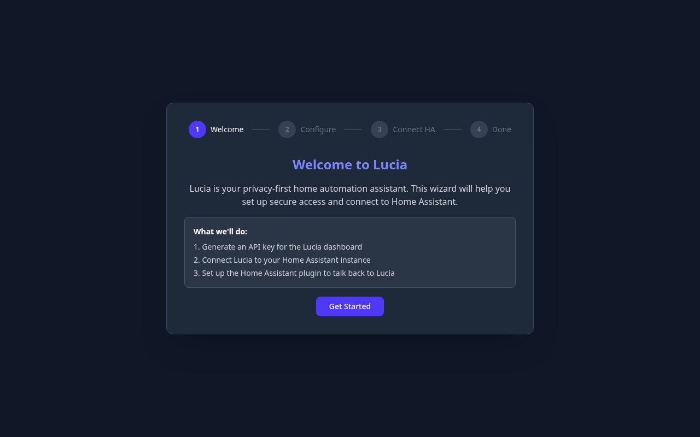

   **Step 1 — Welcome:** Overview of what the wizard will configure.

   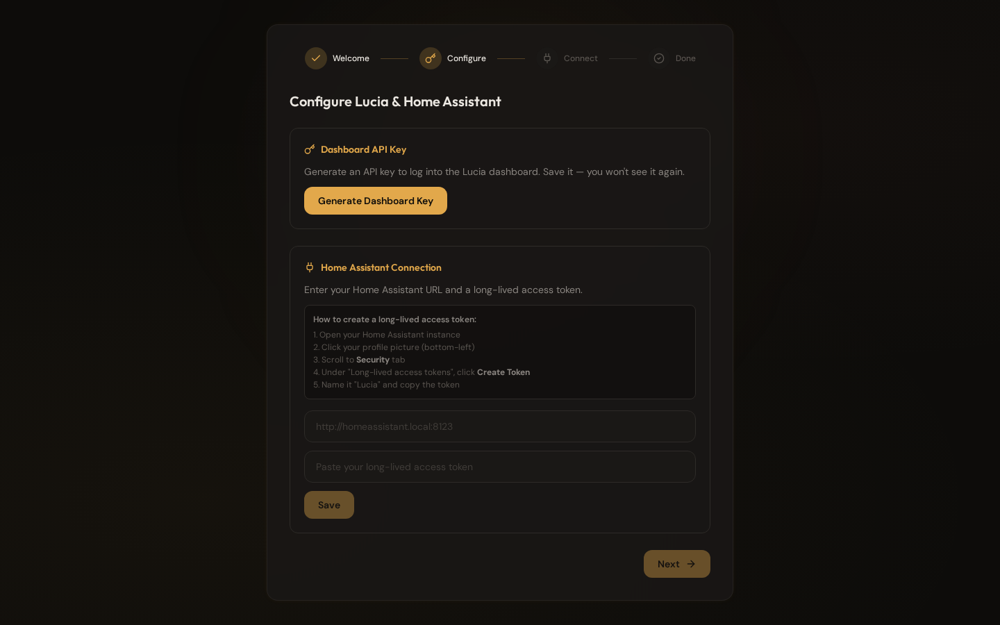

   **Step 2 — Configure:** Generate a Dashboard API key and connect to your Home Assistant instance by entering its URL and a long-lived access token.

   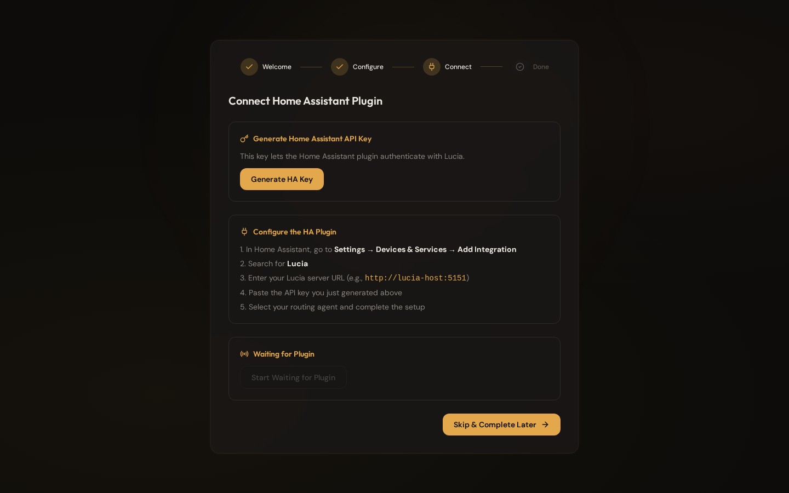

   **Step 3 — Connect HA Plugin:** Generate an API key for the Home Assistant custom component, configure it in HA, and wait for the plugin to connect back to Lucia.

   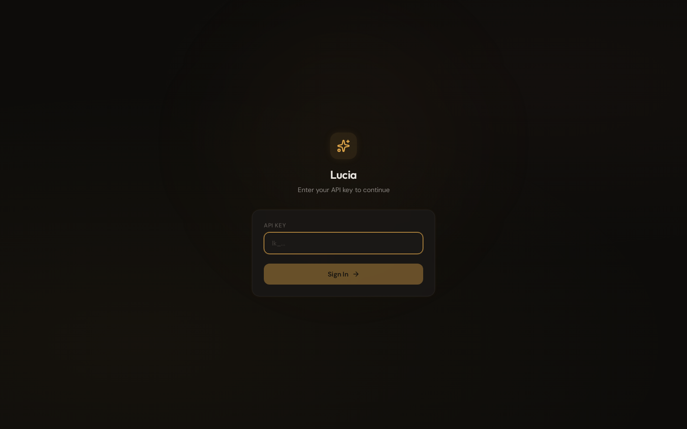

   **Step 4 — Done:** Setup is complete. You'll use the generated API key to sign in.

4. **Sign in to the Dashboard**

   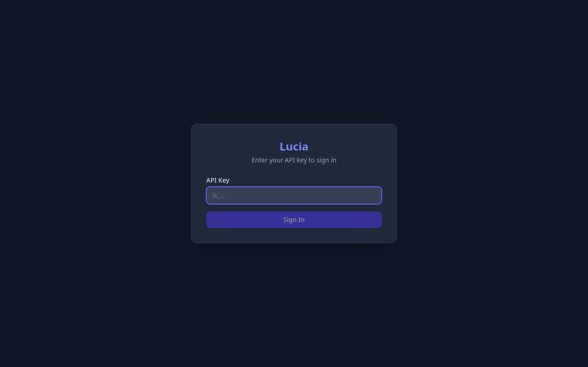

   Enter the API key generated during setup to access the full dashboard.

5. **Install the Home Assistant Integration**

   **Option A: HACS (Recommended)**

   1. Go to HACS → Integrations → three-dot menu → Custom repositories
   2. Add repository URL: `https://github.com/seiggy/lucia-dotnet`
   3. Select category: Integration → Click "Add"
   4. Find "Lucia" in HACS and click "Download"
   5. Restart Home Assistant
   6. Add integration: Settings → Devices & Services → Add Integration → Lucia

   **Option B: Manual Installation**

   ```bash
   cp -r custom_components/lucia /path/to/homeassistant/custom_components/
   # Restart Home Assistant, then add the integration via UI
   ```

## 📊 Dashboard

Lucia includes a full-featured React dashboard for managing your agent platform. Built with React 19, Vite 7, TanStack Query, and Tailwind CSS, it runs as part of the Aspire-orchestrated development stack.

### Activity

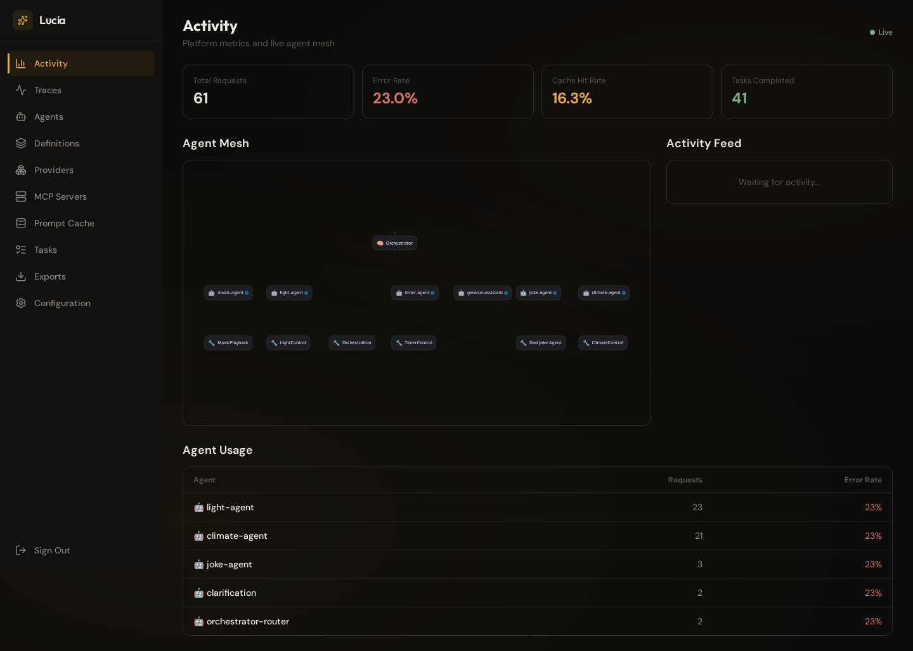

The default landing page shows real-time platform metrics and a live agent mesh visualization. Summary cards display total requests, error rate, cache hit rate, and task completion. The interactive mesh graph (powered by React Flow) shows the orchestrator, agents, and tools with animated connections during active requests. A live activity feed streams SSE events as they happen—routing decisions, tool calls, agent completions, and errors—all in real time.

### Traces

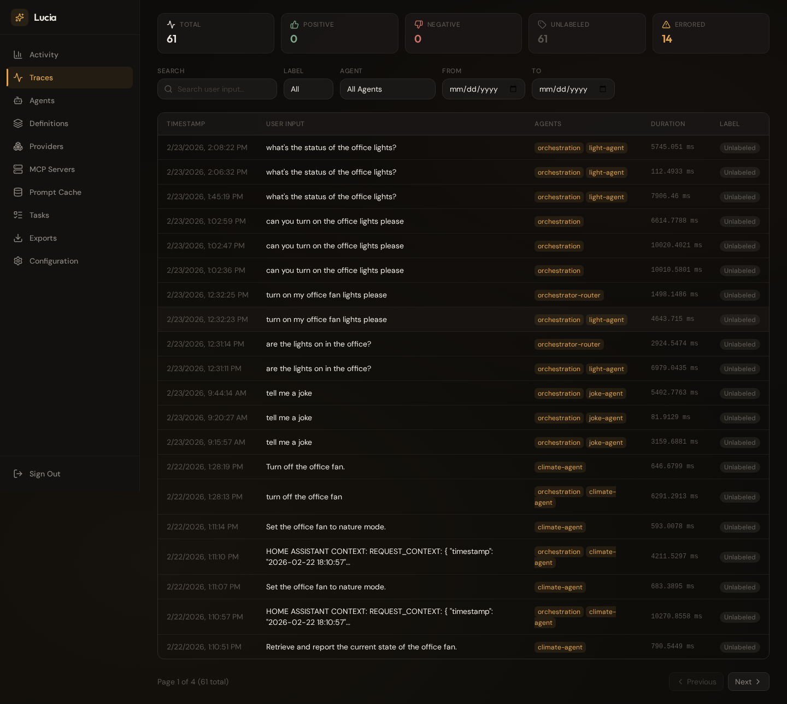

Monitor every conversation passing through the orchestrator. Filter by label, agent, and date range. View stats at a glance with color-coded counters for positive, negative, unlabeled, and errored traces. Click any trace to see the full routing decision, agent execution details, and tool calls.

### Agents

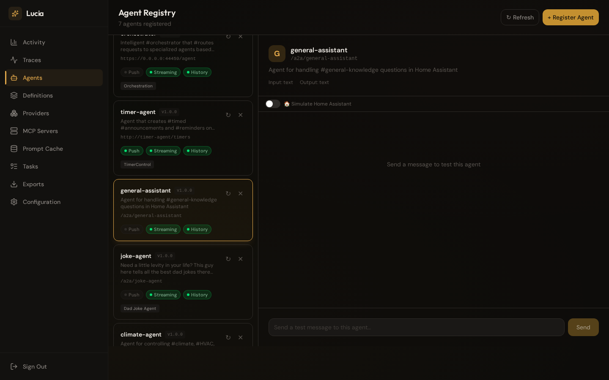

View all registered agents with their capabilities, skills, and connection status. Register new A2A agents, refresh agent metadata, and send test messages directly from the dashboard. Each agent card shows its version, endpoint URL, supported capabilities (Push, Streaming, History), and associated skills.

### Agent Definitions

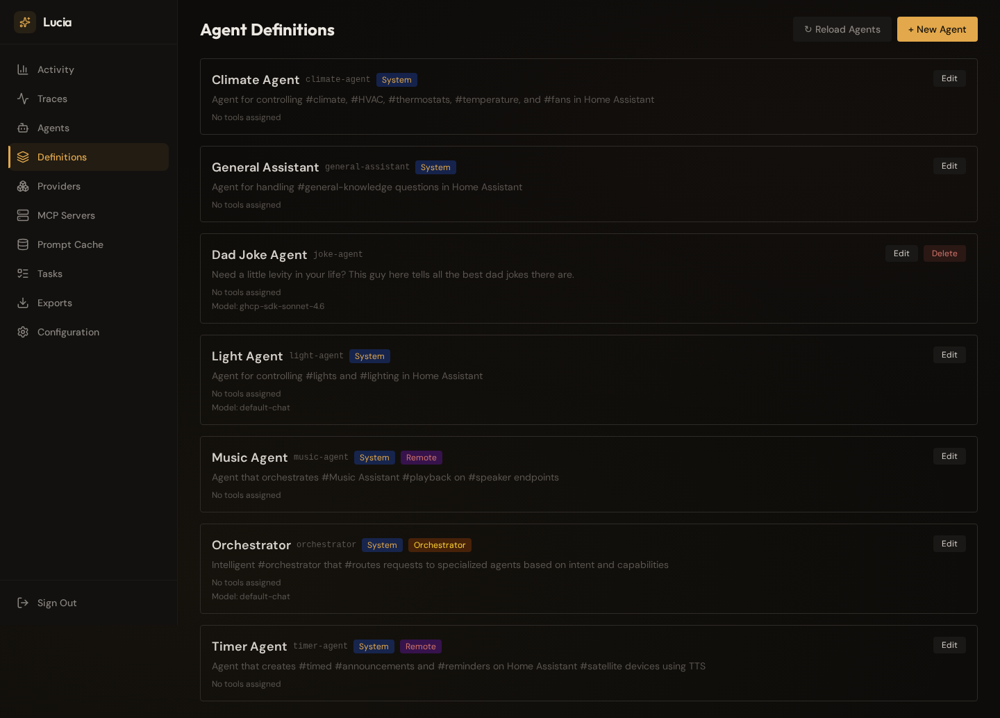

Create and manage custom agents at runtime—no code changes required. Each agent definition includes a name, system prompt, optional model connection override, and a granular MCP tool picker. Tags indicate system vs. user-defined agents. Changes take effect immediately; agents are loaded from MongoDB on each invocation.

### Model Providers

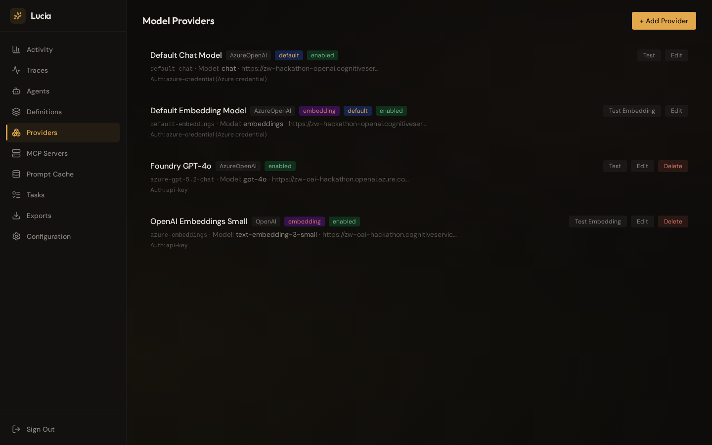

Manage LLM provider connections across the platform. Configure Azure AI Foundry, OpenAI, Ollama, and other OpenAI-compatible endpoints. Each provider card shows the model name, endpoint URL, and deployment type. Copilot-connected models display a badge.

### MCP Servers

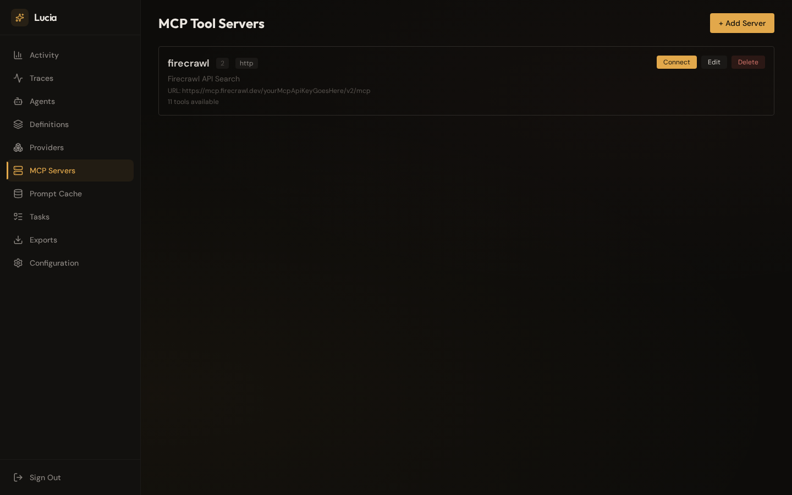

Register and manage MCP (Model Context Protocol) tool servers. Add stdio-based local tools (e.g., `dnx` .NET tools) or remote HTTP/SSE servers. Connect servers to discover available tools, view connection status, and manage environment variables and authentication headers.

### Configuration

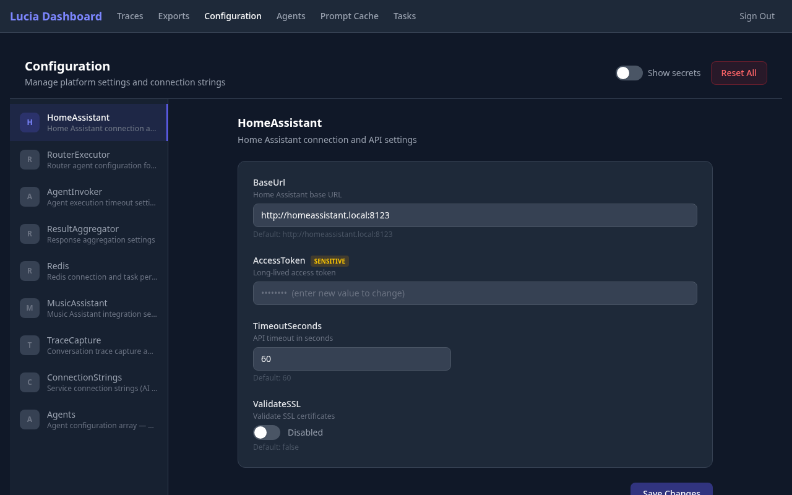

Schema-driven configuration editor with categorized settings. Manage Home Assistant connection details, orchestration parameters (RouterExecutor, AgentInvoker, ResultAggregator), Redis/MongoDB connection strings, Music Assistant integration, trace capture settings, and agent definitions—all from one page. Sensitive values are masked with a "Show secrets" toggle. Mobile-friendly with a dropdown category selector on small screens.

### Dataset Exports

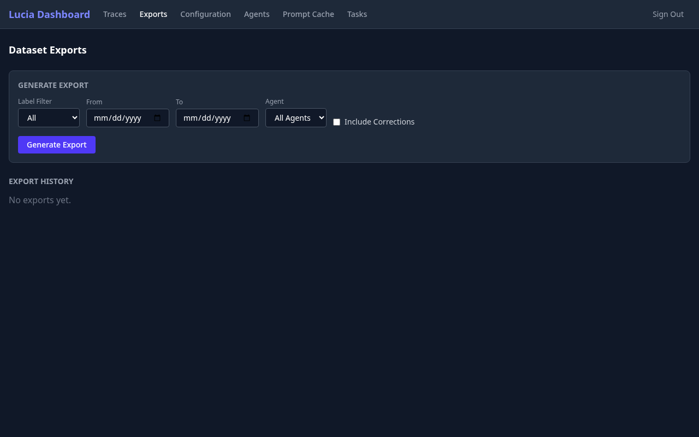

Export labeled conversation traces as training datasets. Filter by label, date range, and agent. Optionally include human corrections for RLHF-style fine-tuning. View export history and re-download previous exports.

### Prompt Cache

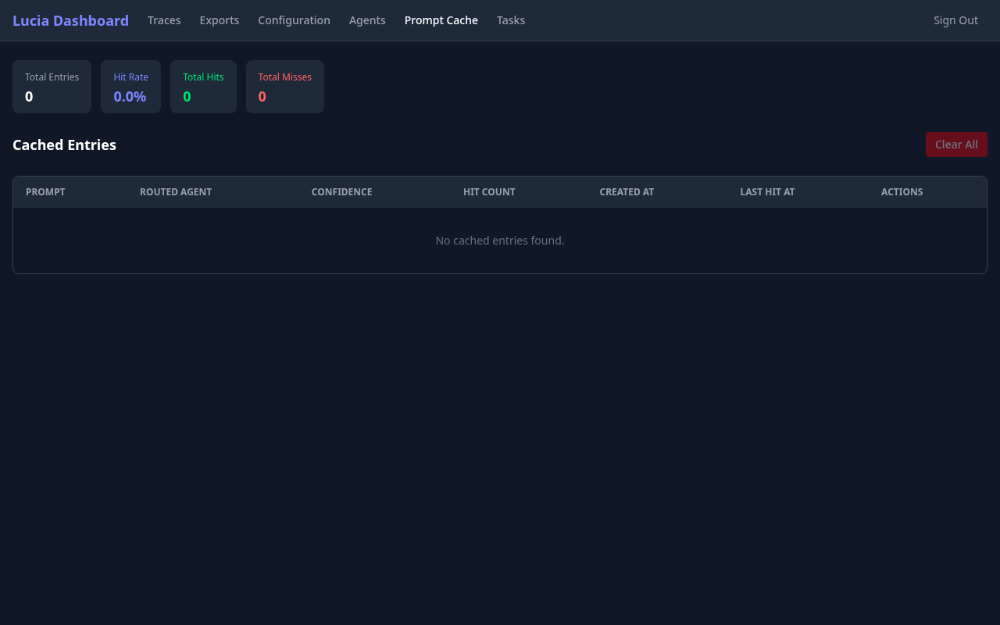

Monitor the routing prompt cache that accelerates repeated queries. View cache statistics (total entries, hit rate, hits vs misses), browse cached entries with their routed agents and confidence scores, and clear the cache when needed. Tabbed view separates Router and Agent cache namespaces with independent stats.

### Tasks

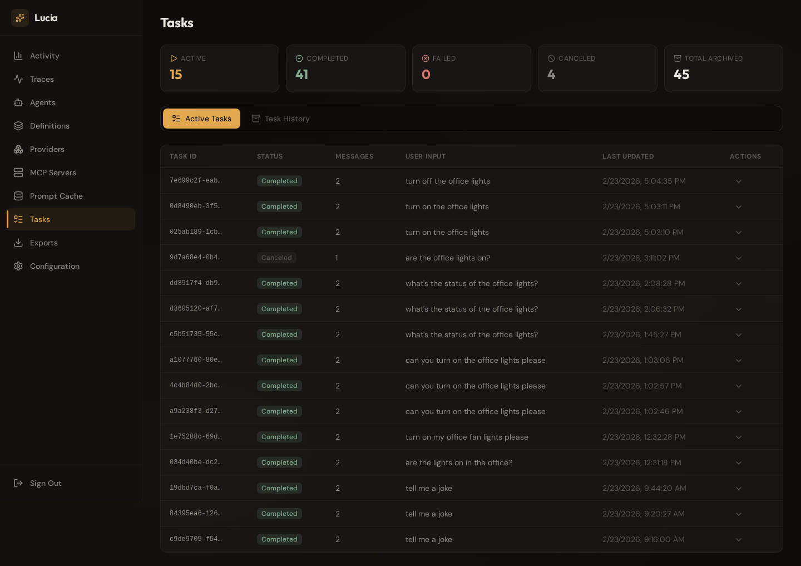

Track active and archived tasks with status counters (Active, Completed, Failed, Cancelled). Switch between Active Tasks and Task History views to monitor ongoing work and review completed operations.

### Entity Location

Manage the Home Assistant entity hierarchy — floors, areas, and entities — with visibility controls. Toggle entity visibility to control which devices Lucia agents can see. Pull the HA exposed-entity list over WebSocket for pre-filtered entity management. Search and filter entities by area, domain, or name.

### Matcher Debug

Interactive testing page for the HybridEntityMatcher. Enter a search query and see scored results with per-signal breakdowns (Levenshtein, Jaro-Winkler, phonetic, embedding similarity, alias match). Useful for tuning match weights and diagnosing entity resolution issues.

## 🏗️ Architecture

Lucia uses the **A2A (Agent-to-Agent) Protocol** with **JSON-RPC 2.0** for agent communication. The orchestrator routes incoming requests to the best-fit specialized agent, with results aggregated and returned to Home Assistant.

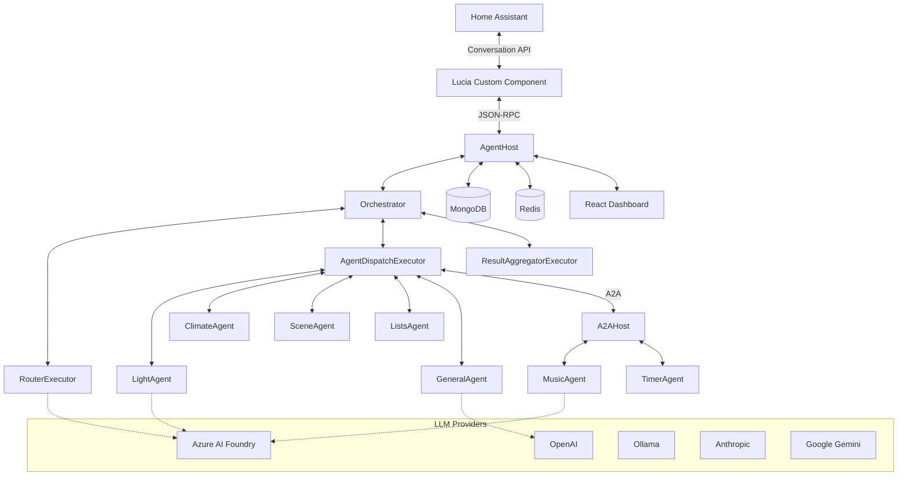
```mermaid
graph TB
    HA[Home Assistant] <-->|Conversation API| HP[Lucia Custom Component]
    HP <-->|JSON-RPC| AH[AgentHost]

    AH <--> O[Orchestrator]
    O <--> Router[RouterExecutor]
    O <--> Dispatch[AgentDispatchExecutor]
    O <--> Agg[ResultAggregatorExecutor]

    Dispatch <--> LA[LightAgent]
    Dispatch <--> CA[ClimateAgent]
    Dispatch <--> SA[SceneAgent]
    Dispatch <--> LiA[ListsAgent]
    Dispatch <--> GA[GeneralAgent]
    Dispatch <-->|A2A| A2A[A2AHost]

    A2A <--> MA[MusicAgent]
    A2A <--> TA[TimerAgent]

    AH <--> DB[(MongoDB)]
    AH <--> Cache[(Redis)]
    AH <--> Dashboard[React Dashboard]

    subgraph "LLM Providers"
        Azure[Azure AI Foundry]
        OAI[OpenAI]
        Ollama[Ollama]
        Anthropic[Anthropic]
        Gemini[Google Gemini]
    end

    Router -.-> Azure
    LA -.-> Azure
    GA -.-> OAI
    MA -.-> Azure
```

### Communication Flow

1. **User Input** → Home Assistant receives a voice or text command
2. **Conversation API** → Lucia custom component sends the message via JSON-RPC
3. **Orchestrator** → RouterExecutor selects the best agent using semantic matching and prompt caching
4. **Agent Dispatch** → AgentDispatchExecutor forwards the request (in-process or via A2A)
5. **LLM Processing** → The selected agent calls its LLM with domain-specific tools
6. **Result Aggregation** → ResultAggregatorExecutor formats the final response
7. **Response** → JSON-RPC response returned to Home Assistant for speech output

### Key Components

| Component | Description |
|-----------|-------------|
| **AgentHost** (`lucia.AgentHost`) | Main API server hosting the orchestrator, agents, auth, configuration, and dashboard proxy |
| **A2AHost** (`lucia.A2AHost`) | Satellite host for running agents as separate processes (MusicAgent, TimerAgent) |
| **Orchestrator** (`lucia.Agents/Orchestration`) | Router → Dispatch → Aggregator pipeline for multi-agent coordination |
| **Dashboard** (`lucia-dashboard`) | React 19 SPA with 20+ pages for management, traces, entity control, exports, and configuration |
| **Home Assistant Integration** (`custom_components/lucia`) | Python custom component with conversation platform |
| **HomeAssistant Client** (`lucia.HomeAssistant`) | Strongly-typed .NET client for the HA REST and WebSocket APIs |
| **Entity Location Service** (`lucia.Agents/Services`) | Centralized entity resolution with hierarchical floor/area/entity search and Redis caching |
| **HybridEntityMatcher** (`lucia.Agents/Models`) | Multi-weighted entity matching engine (Levenshtein, Jaro-Winkler, phonetic, embeddings, aliases) |
| **Model Provider System** (`lucia.Agents/Services`) | Configurable LLM backend management with per-agent model assignment and connection testing |
| **Plugin System** (`lucia.Agents/Extensions`) | Roslyn script plugin engine with four-hook lifecycle, repository management, and dashboard UI |
| **Alarm Clock System** (`lucia.Agents/Alarms`) | CRON-scheduled alarms with volume ramping, sound library, and voice dismissal |
| **Presence Detection** (`lucia.Agents/Services`) | Auto-discovered room-level presence with confidence-weighted sensor fusion |

## 📁 Project Structure

```
lucia-dotnet/
├── lucia.AppHost/                # .NET Aspire orchestrator (recommended dev entrypoint)
├── lucia.AgentHost/              # ASP.NET Core API host
│   ├── Auth/                     # API key authentication and session management
│   ├── Extensions/               # Setup, Configuration, A2A, Plugin, and Auth API endpoints
│   └── plugins/                  # Agent Framework plugins
├── lucia.A2AHost/                # A2A satellite agent host
│   ├── AgentRegistry/            # Agent card registration
│   ├── Extensions/               # A2A endpoint mapping
│   └── Services/                 # Agent initialization
├── lucia.Agents/                 # Shared agent implementations and orchestration
│   ├── Abstractions/             # ILuciaPlugin, IWebSearchSkill, IEntityLocationService, IHybridEntityMatcher
│   ├── Agents/                   # GeneralAgent, LightAgent, ClimateAgent, SceneAgent, ListsAgent, OrchestratorAgent
│   ├── Configuration/            # Plugin, repository, and manifest models
│   ├── Extensions/               # PluginLoader, PluginScriptHost, service registrations
│   ├── Integration/              # SearchTermCache, SearchTermNormalizer
│   ├── Models/                   # HybridEntityMatcher, HomeAssistantEntity, HybridMatchOptions
│   ├── Orchestration/            # RouterExecutor, AgentDispatchExecutor, etc.
│   ├── Registry/                 # Agent discovery and registration
│   ├── Services/                 # EntityLocationService, PresenceDetection, PluginManagement, ModelProviders
│   ├── Skills/                   # LightControlSkill, ClimateControlSkill, FanControlSkill, SceneControlSkill, ListSkill
│   └── Training/                 # Trace capture and export
├── lucia.MusicAgent/             # Music Assistant playback agent (A2AHost)
├── lucia.TimerAgent/             # Timer and reminder agent (A2AHost)
├── lucia.HomeAssistant/          # Strongly-typed HA REST API client
│   ├── Models/                   # Entity, state, and service models
│   ├── Services/                 # IHomeAssistantClient implementation
│   └── Configuration/            # Client settings
├── lucia-dashboard/              # React 19 + Vite 7 management dashboard
│   └── src/
│       ├── pages/                # Activity, Traces, Agents, AgentDefs, ModelProviders, McpServers, Config, Exports, Cache, Tasks, Alarms, Presence, Plugins, EntityLocation, MatcherDebug, SkillOptimizer, Lists
│       ├── components/           # MeshGraph, PluginRepoDialog, RestartBanner, shared UI
│       ├── hooks/                # useActivityStream and custom React hooks
│       ├── context/              # Auth context and providers
│       └── api.ts                # API client functions
├── plugins/                      # Plugin scripts (each subfolder = one plugin)
│   ├── metamcp/plugin.cs         # MetaMCP tool aggregation bridge
│   └── searxng/plugin.cs         # SearXNG web search skill
├── lucia-plugins.json            # Official plugin repository manifest
├── lucia.ServiceDefaults/        # OpenTelemetry, health checks, resilience
├── lucia.Tests/                  # xUnit tests (unit, integration, eval, plugin system)
├── custom_components/lucia/      # Home Assistant Python custom component
│   ├── conversation.py           # JSON-RPC conversation platform
│   ├── config_flow.py            # HA configuration UI with agent selection
│   └── translations/             # Multi-language UI strings
└── infra/                        # Deployment infrastructure
    ├── docker/                   # Dockerfiles and docker-compose.yml
    ├── kubernetes/
    │   ├── manifests/            # K8s YAML manifests
    │   └── helm/                 # Helm chart
    └── systemd/                  # systemd service units
```

## 🔧 Configuration

Lucia uses a schema-driven configuration system stored in MongoDB. On first run, the setup wizard guides you through the essential settings. After setup, all configuration can be managed through the dashboard's Configuration page.

### Key Configuration Sections

| Section | Description |
|---------|-------------|
| **HomeAssistant** | Base URL, access token, API timeout, SSL validation |
| **RouterExecutor** | Agent routing model, semantic similarity threshold |
| **AgentInvoker** | Agent execution timeout settings |
| **ResultAggregator** | Response aggregation settings |
| **Redis** | Connection string and task persistence TTL |
| **MusicAssistant** | Music Assistant integration settings |
| **TraceCapture** | Conversation trace storage settings |
| **ConnectionStrings** | AI Foundry, MongoDB, and Redis connection details |
| **Agents** | Agent definitions and registration |
| **ModelProviders** | LLM backend configurations (per-agent model assignment) |
| **PromptCache** | Routing and chat cache thresholds (hot-reloadable) |

### Home Assistant Integration Setup

After installing the custom component:

1. Go to Settings → Devices & Services → Add Integration → Lucia
2. Enter your Agent Repository URL (e.g., `https://localhost:7235`)
3. Add the API Key generated during dashboard setup
4. Configure agent selection — choose from discovered agents in the dropdown
5. Set as your conversation agent under Settings → Voice Assistants → Assist

## 🤝 Agent System

### A2A Protocol (Agent-to-Agent)

Agents communicate via the A2A Protocol with JSON-RPC 2.0. The AgentHost runs in-process agents (LightAgent, ClimateAgent, SceneAgent, ListsAgent, GeneralAgent, Orchestrator) while the A2AHost runs satellite agents (MusicAgent, TimerAgent) as separate processes.

#### Agent Discovery

```bash
# List all registered agents
curl http://localhost:5151/agents
```

#### Sending Messages

```bash
curl -X POST http://localhost:5151/a2a/light-agent \
  -H "Content-Type: application/json" \
  -d '{
    "jsonrpc": "2.0",
    "method": "message/send",
    "params": {
      "message": {
        "kind": "message",
        "role": "user",
        "parts": [{"kind": "text", "text": "Turn on the living room lights"}],
        "messageId": "550e8400-e29b-41d4-a716-446655440000",
        "contextId": "550e8400-e29b-41d4-a716-446655440001"
      }
    },
    "id": 1
  }'
```

### Creating Custom Agents (Runtime)

Lucia supports creating agents at runtime through the dashboard UI. Custom agents are stored in MongoDB and loaded dynamically—no code changes or restarts required.

**1. Register MCP Tool Servers**

Navigate to **MCP Servers** in the dashboard and add your tool servers:

- **stdio transports** — local processes (e.g., `dnx my-tool`, `npx @scope/tool`). The container ships with the .NET SDK, so `dnx` tools work out of the box. For `npx`, `python`, or other runtimes, extend the container image.
- **HTTP/SSE transports** — remote MCP servers accessible via URL.

After adding a server, click **Connect** then **Discover Tools** to see available tools.

**2. Define an Agent**

Navigate to **Agent Definitions** and click **New Agent**:

| Field | Description |
|-------|-------------|
| **Name** | Unique agent identifier (e.g., `research-agent`) |
| **Display Name** | Human-readable name for the dashboard |
| **Instructions** | System prompt that defines the agent's behavior |
| **Model Connection** | Optional override (blank = default model) |
| **MCP Tools** | Select individual tools from registered MCP servers |

**3. Use the Agent**

Once saved, the agent is immediately available to the orchestrator's router. The router considers the agent's description and tool capabilities when making routing decisions. No reload required—agents are loaded from MongoDB on each invocation.

**Extending the container for non-.NET runtimes:**

```dockerfile
# Example: Add Node.js for npx-based MCP tools
FROM ghcr.io/seiggy/lucia-dotnet:latest
RUN apt-get update && apt-get install -y nodejs npm
```

## 🔌 Plugin System

Lucia features a script-based plugin system powered by [Roslyn CSharpScript](https://learn.microsoft.com/en-us/dotnet/csharp/roslyn-sdk/). Plugins are plain C# files — no project files, no separate DLLs, no compilation step. Drop a folder with a `plugin.cs` into the `plugins/` directory and Lucia loads it at startup.

### Plugin Lifecycle

Plugins implement the `ILuciaPlugin` interface and participate in four lifecycle hooks, called in order:

| Hook | When | Use Case |
|------|------|----------|
| `ConfigureServices(IHostApplicationBuilder)` | Before app is built | Register DI services (e.g., `IWebSearchSkill`) |
| `ExecuteAsync(IServiceProvider, CancellationToken)` | After app is built, before HTTP starts | Run initialization, seed data |
| `MapEndpoints(WebApplication)` | During endpoint registration | Add custom HTTP endpoints |
| `OnSystemReadyAsync(IServiceProvider, CancellationToken)` | After all agents are online | Logic that depends on agents or Home Assistant |

All hooks have default no-op implementations — only override what you need.

### Creating a Plugin

**1. Create a folder** under `plugins/` with your plugin's ID:

```
plugins/
└── my-plugin/
    └── plugin.cs
```

**2. Write your `plugin.cs`** — the script must define a class implementing `ILuciaPlugin` and end with an expression that returns an instance of it:

```csharp
// plugins/my-plugin/plugin.cs
using lucia.Agents.Abstractions;
using Microsoft.Extensions.DependencyInjection;
using Microsoft.Extensions.Logging;

public class MyPlugin : ILuciaPlugin
{
    public string PluginId => "my-plugin";

    public void ConfigureServices(IHostApplicationBuilder builder)
    {
        // Register services into the DI container before the app is built
        builder.Services.AddSingleton<IMyService, MyServiceImpl>();
    }

    public async Task ExecuteAsync(IServiceProvider services, CancellationToken ct = default)
    {
        var logger = services.GetRequiredService<ILoggerFactory>().CreateLogger("MyPlugin");
        logger.LogInformation("My plugin initialized.");
    }

    public async Task OnSystemReadyAsync(IServiceProvider services, CancellationToken ct = default)
    {
        // Agents and Home Assistant are fully available here
        var logger = services.GetRequiredService<ILoggerFactory>().CreateLogger("MyPlugin");
        logger.LogInformation("System ready — all agents online.");
    }
}

// The last expression MUST return an ILuciaPlugin instance
new MyPlugin()
```

**3. That's it.** Restart Lucia and your plugin will be discovered and loaded automatically.

### Available Namespaces and Assemblies

Plugin scripts run in a sandboxed Roslyn environment with a curated set of assemblies and auto-imported namespaces. You do **not** need `using` directives for these — they are pre-imported:

**Auto-imported namespaces:**

| Namespace | Description |
|-----------|-------------|
| `System` | Core .NET types |
| `System.Collections.Generic` | Lists, dictionaries, etc. |
| `System.Linq` | LINQ query operators |
| `System.Threading` | `CancellationToken`, synchronization |
| `System.Threading.Tasks` | `Task`, `ValueTask`, async patterns |
| `System.Net.Http` | `HttpClient`, `IHttpClientFactory` |
| `lucia.Agents.Abstractions` | `ILuciaPlugin`, `IWebSearchSkill`, etc. |
| `Microsoft.Extensions.DependencyInjection` | `IServiceCollection`, `AddSingleton`, etc. |
| `Microsoft.Extensions.Hosting` | `IHostApplicationBuilder`, `BackgroundService` |
| `Microsoft.Extensions.Logging` | `ILogger`, `ILoggerFactory` |
| `Microsoft.Extensions.Configuration` | `IConfiguration` |
| `Microsoft.Extensions.AI` | `AITool`, `AIFunctionFactory` |

**Additional assemblies available** (require explicit `using` in your script):

| Assembly | Key Types |
|----------|-----------|
| `System.Text.Json` | `JsonSerializer`, `JsonSerializerOptions` |
| `System.ComponentModel.Primitives` | `DescriptionAttribute` |
| `System.Diagnostics.DiagnosticSource` | `ActivitySource`, `Meter`, `Counter<T>`, `Histogram<T>` |
| `Microsoft.AspNetCore` | `WebApplication`, `IEndpointRouteBuilder` |

> **Note:** If you need an assembly that isn't listed above, the plugin won't compile. File an issue or PR to add it to the host's reference set in `PluginScriptHost.cs`.

### Plugin Examples

**MetaMCP Bridge** (`plugins/metamcp/`) — Seeds a MetaMCP tool server into the agent registry:

```csharp
public class MetaMcpPlugin : ILuciaPlugin
{
    public string PluginId => "metamcp";

    public async Task ExecuteAsync(IServiceProvider services, CancellationToken ct = default)
    {
        var config = services.GetRequiredService<IConfiguration>();
        var url = config["METAMCP_URL"];
        if (string.IsNullOrWhiteSpace(url)) return;
        // ... seed the MCP tool server definition into MongoDB
    }
}

new MetaMcpPlugin()
```

**SearXNG Web Search** (`plugins/searxng/`) — Registers `IWebSearchSkill` so the GeneralAgent gains web search:

```csharp
public sealed class SearXngPlugin : ILuciaPlugin
{
    public string PluginId => "searxng";

    public void ConfigureServices(IHostApplicationBuilder builder)
    {
        var url = builder.Configuration["SearXng:BaseUrl"];
        if (!string.IsNullOrWhiteSpace(url))
        {
            builder.Services.AddSingleton<IWebSearchSkill>(sp =>
                new SearXngWebSearchSkill(
                    sp.GetRequiredService<IHttpClientFactory>(),
                    url,
                    sp.GetRequiredService<ILoggerFactory>().CreateLogger<SearXngWebSearchSkill>()));
        }
    }
}
// ... skill class, then:
new SearXngPlugin()
```

### Plugin Repository System

Plugins can be discovered, installed, and managed through the dashboard's **Plugins** page. Repositories are remote or local sources that provide a manifest of available plugins.

#### Repository Manifest (`lucia-plugins.json`)

Every repository is defined by a `lucia-plugins.json` manifest file:

```json
{
  "id": "lucia-official",
  "name": "Lucia Official Plugins",
  "plugins": [
    {
      "id": "metamcp",
      "name": "MetaMCP Bridge",
      "description": "Bridges MetaMCP tool aggregation into Lucia agents.",
      "version": "1.0.0",
      "path": "plugins/metamcp"
    },
    {
      "id": "searxng",
      "name": "SearXNG Web Search",
      "description": "Privacy-respecting web search via SearXNG.",
      "version": "1.0.0",
      "path": "plugins/searxng"
    }
  ]
}
```

| Field | Required | Description |
|-------|----------|-------------|
| `id` | ✅ | Unique repository identifier |
| `name` | ✅ | Human-readable repository name |
| `plugins` | ✅ | Array of plugin entries |
| `plugins[].id` | ✅ | Unique plugin identifier |
| `plugins[].name` | ✅ | Display name |
| `plugins[].description` | ✅ | Short description |
| `plugins[].version` | ✅ | SemVer version string |
| `plugins[].path` | ✅ | Path to the plugin folder, relative to the repo root |
| `plugins[].author` | ❌ | Author name |
| `plugins[].tags` | ❌ | Array of tags for categorization |

#### Creating Your Own Plugin Repository

To publish your own plugins as a repository:

1. **Create a GitHub repository** with your plugins under a `plugins/` directory
2. **Add a `lucia-plugins.json`** at the repo root with your manifest
3. **Each plugin** must have a `plugin.cs` entry point in its folder
4. **Add the repo in Lucia** — go to Plugins → Repositories → Add Repository, enter your GitHub URL and branch

#### Git Blob Source Strategies

When adding a Git-based repository, the `blobSource` field controls how plugin archives are downloaded:

| Strategy | Behavior |
|----------|----------|
| `release` (default) | Fetches the latest GitHub Release. Looks for a `{pluginId}.zip` asset first, falls back to the release zipball, then to a branch archive. Best for production repositories. |
| `tag` | Downloads the archive at a specific tag (`Branch` field = tag name). Useful for pinning to a known version. |
| `branch` | Downloads the archive at branch HEAD. Best for development or bleeding-edge tracking. |

The release strategy is recommended for production use — publish per-plugin zip files as GitHub Release assets for the fastest, most targeted downloads.

#### Managing Plugins via the Dashboard

The **Plugins** page has three tabs:

- **Installed** — View, enable/disable, and uninstall plugins. Changes require an app restart (a banner will prompt you).
- **Store** — Browse available plugins from all configured repositories. One-click install.
- **Repositories** — Add, remove, and sync plugin repositories. Supports both local (development) and Git (production) sources.

## 🧪 Development

### Prerequisites

- [.NET 10 SDK](https://dotnet.microsoft.com/download) or later
- [Node.js 22+](https://nodejs.org/) (for the dashboard)
- [Docker](https://www.docker.com/) (required for Redis and MongoDB via Aspire)

### Building from Source

```bash
# Build the entire solution
dotnet build lucia-dotnet.slnx

# Run via Aspire (recommended — starts all services in mesh mode)
dotnet run --project lucia.AppHost

# Run tests (excludes slow eval tests)
dotnet test --filter 'Category!=Eval'

# Run all tests including LLM-based evals
dotnet test

# Run AgentHost directly (without Aspire)
dotnet run --project lucia.AgentHost

# Dashboard dev server (standalone)
cd lucia-dashboard && npm install && npm run dev
```

### Service Endpoints

When running via Aspire AppHost:

| Service | HTTP | HTTPS |
|---------|------|-------|
| AgentHost API | `http://localhost:5151` | `https://localhost:7235` |
| Dashboard | Assigned by Aspire | — |
| Aspire Dashboard | — | `https://localhost:17274` |
| API Documentation (Scalar) | — | `https://localhost:7235/scalar` |
| Health Check | `http://localhost:5151/health` | — |

### Building the Docker Image Locally

To build from source instead of using the pre-built image:

```bash
git clone https://github.com/seiggy/lucia-dotnet.git
cd lucia-dotnet/infra/docker
docker compose up -d
```

The [`docker-compose.yml`](infra/docker/docker-compose.yml) in the repo builds the image from the local Dockerfile. See [`infra/docker/DEPLOYMENT.md`](infra/docker/DEPLOYMENT.md) for the full deployment guide.

## 🐳 Deployment

### Deployment Modes

Lucia supports two deployment topologies controlled by the `Deployment__Mode` environment variable:

| Mode | Value | Description |
|------|-------|-------------|
| **Standalone** (default) | `standalone` | All agents (Music, Timer, etc.) run embedded in the main AgentHost process. Simplest setup — single container plus Redis and MongoDB. Recommended for most users. |
| **Mesh** | `mesh` | Agents run as separate A2A containers that register with the AgentHost over the network. Used for Kubernetes deployments, horizontal scaling, or multi-node distribution. |

> **⚠️ Single-Instance Constraint:** The AgentHost must run as a **single instance** (no horizontal scaling via replicas). The in-memory `ScheduledTaskStore` and `ActiveTimerStore` hold active alarms and timers — running multiple replicas would split scheduled task state across instances. For high availability, use a single replica with fast restart policies rather than multiple replicas behind a load balancer. This constraint applies to both standalone and mesh modes (the AgentHost itself must be single-instance; mesh agents can scale independently).

**When to use each mode:**

- **Standalone** — Home lab, single-server, Docker Compose, or any deployment where simplicity matters. External A2A agents can still connect to a standalone AgentHost.
- **Mesh** — Kubernetes clusters, multi-node setups, or when you want to scale individual agents independently. The Helm chart and K8s manifests default to mesh mode.

To switch modes, add the environment variable to your `docker-compose.yml`:
```yaml
environment:
  - Deployment__Mode=mesh
```

### Kubernetes

```bash
# Using manifests
kubectl apply -f infra/kubernetes/manifests/

# Using Helm
helm install lucia infra/kubernetes/helm/lucia-helm \
  --namespace lucia --create-namespace
```

The Kubernetes deployment runs in **mesh mode** by default, with Music Agent and Timer Agent as separate pods. See [`infra/kubernetes/`](infra/kubernetes/) for manifests and Helm chart documentation.

### systemd

For bare-metal or VM deployments, systemd service units are provided in [`infra/systemd/`](infra/systemd/).

## 📊 Monitoring and Observability

Lucia includes OpenTelemetry instrumentation out of the box via the `lucia.ServiceDefaults` project:

- **Traces** — Distributed tracing across orchestrator, agents, and Home Assistant API calls
- **Metrics** — Request rates, agent execution duration, LLM token usage
- **Logs** — Structured logging with correlation IDs and agent-specific filtering

The Aspire Dashboard provides built-in log aggregation, trace visualization, and metrics during development. Lucia's own Activity Dashboard shows a live agent mesh graph and real-time event stream. For production, export to Prometheus, Grafana, Jaeger, or any OTLP-compatible backend.

## 🗺️ Roadmap

### ✅ Completed

- Multi-agent orchestration with Router → Dispatch → Aggregator pipeline
- LightAgent with semantic entity search
- ClimateAgent with HVAC and fan control
- SceneAgent for scene activation and management
- ListsAgent for todo and reminder list management
- MusicAgent for Music Assistant playback
- TimerAgent with background timer lifecycle and satellite announce
- Entity Location Service with floor/area/alias/feature resolution
- HybridEntityMatcher with multi-weighted search (Levenshtein, Jaro-Winkler, phonetic, embeddings, aliases)
- Unified entity architecture with `HomeAssistantEntity` base class and domain subtypes
- Entity visibility filtering with dashboard controls and HA exposed-entity WebSocket support
- Model Provider system with 6+ LLM backends configurable from the dashboard
- Runtime MCP tool server registration and dynamic agent definitions with hot-reload
- A2A Protocol (JSON-RPC 2.0) implementation
- Home Assistant custom component with agent selection
- Guided setup wizard with AI provider configuration, agent health gate, and resume flow
- React management dashboard (20+ pages) with traces, entity management, exports, configuration
- Live Activity Dashboard with real-time agent mesh visualization
- Full OpenTelemetry coverage for LLM calls (gen_ai.* spans)
- Per-agent error rate metrics and observability
- Two-tier prompt caching (routing + chat) with semantic similarity and hot-reloadable thresholds
- Helm charts and Kubernetes manifests
- Multi-LLM support (Azure AI Foundry, OpenAI, Ollama, Anthropic, Google Gemini, Azure AI Inference)
- Dataset export for fine-tuning workflows
- Schema-driven configuration system
- Playwright E2E tests for all agent routing modes
- Scheduled Task System with CRON scheduling and MongoDB persistence
- Alarm Clock System with volume ramping and voice dismissal
- Presence Detection Service with auto-discovered sensors and confidence levels
- Alarm Clocks dashboard page with CRON builder and sound management
- Presence Detection dashboard page with sensor management
- Alarm sound file upload with HA media library integration
- Mesh mode deployment hardening (conditional service registration, URL resolution, endpoint deduplication)
- Script-based plugin system with Roslyn CSharpScript, four-hook lifecycle, and plugin repository management
- Plugin dashboard with store, install/uninstall, enable/disable, and repository management
- Internal token authentication for service-to-service A2A communication
- SemVer versioning with preview release support in CI/CD
- Matcher debug API and dashboard page for testing entity search queries

### 🔄 In Progress

- Unified entity search pipeline (replacing per-skill entity lookups with HybridEntityMatcher)
- WebSocket real-time event streaming from Home Assistant (persistent connection)
- HACS store listing for one-click installation

### ⏳ Planned

- CalendarAgent (calendar management and scheduling)
- SecurityAgent (security monitoring and alerts)
- Pattern recognition and automation suggestions
- Local LLM optimization (Ollama performance tuning, edge deployment)
- Voice integration (local STT/TTS)
- GitHub Copilot SDK as a first-class LLM provider
- Mobile companion app

See [.docs/product/roadmap.md](.docs/product/roadmap.md) for the detailed roadmap.

## 🤝 Contributing

We welcome contributions! Whether you're fixing bugs, adding agents, or improving documentation.

1. Fork the repository
2. Create a feature branch: `git checkout -b feature/amazing-feature`
3. Make your changes following existing code style and conventions
4. Add tests for new functionality
5. Commit using [conventional commits](https://www.conventionalcommits.org/): `git commit -m 'feat: add amazing feature'`
6. Push and open a Pull Request

### Areas for Contribution

- 🤖 New specialized agents (security, calendar, media, etc.)
- 🔌 Community plugins (search providers, notification services, calendar integrations)
- 🧠 Additional LLM provider integrations
- 🏠 Enhanced Home Assistant integrations
- 📊 Dashboard features and improvements
- 📚 Documentation
- 🧪 Test coverage
- 🌍 Translations for the Home Assistant custom component

## 📄 License

This project is licensed under the MIT License — see the [LICENSE](LICENSE) file for details.

## 🙏 Acknowledgments

- **[Microsoft Agent Framework](https://github.com/microsoft/agent-framework)** — AI orchestration framework powering our agents
- **[Home Assistant](https://www.home-assistant.io/)** — Open-source home automation platform
- **[.NET Aspire](https://learn.microsoft.com/en-us/dotnet/aspire/)** — Cloud-native app development stack
- **[A2A Protocol](https://github.com/a2aproject/A2A)** — Standardized agent communication protocol
- **[Music Assistant](https://music-assistant.io/)** — Universal music library and playback system

## 📞 Support

- **🐛 Bug Reports**: [GitHub Issues](https://github.com/seiggy/lucia-dotnet/issues)
- **💬 Discussions**: [GitHub Discussions](https://github.com/seiggy/lucia-dotnet/discussions)
- **🏠 Home Assistant**: [Community Forum](https://community.home-assistant.io/)

---

**Built with ❤️ for the Home Assistant community**
