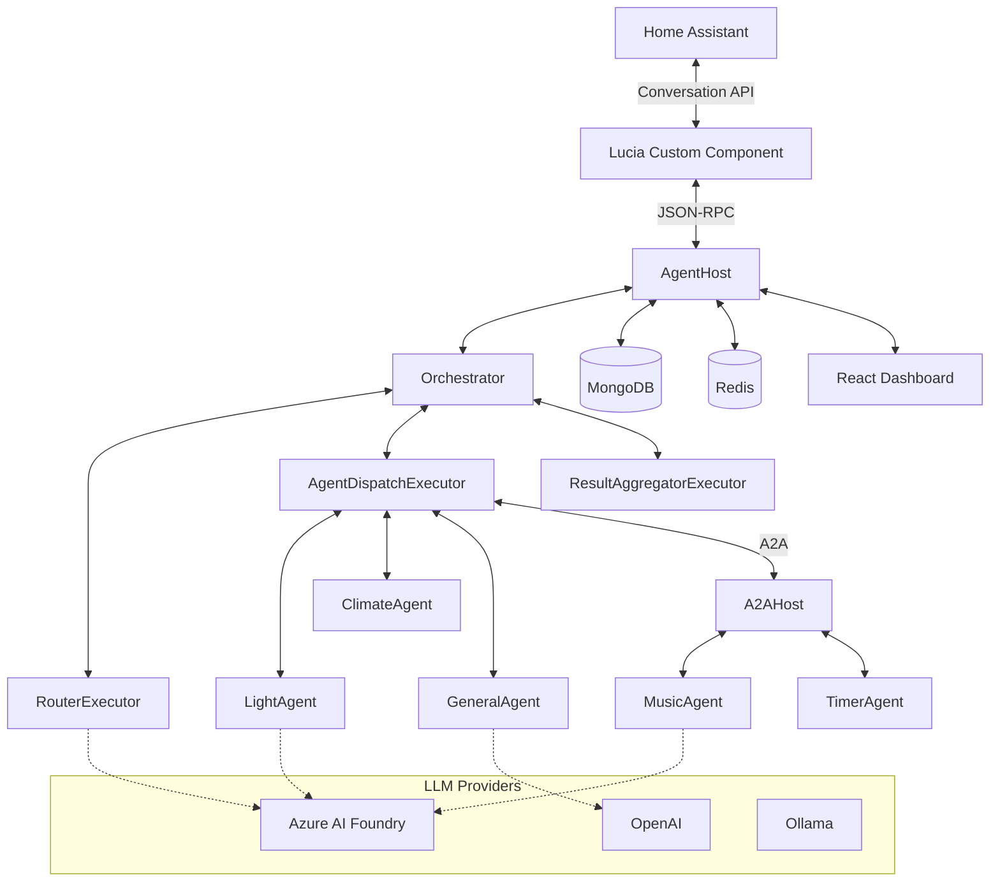

<p align="center">
  
</p>

# Lucia — Autonomous Home Assistant AI

[](https://dotnet.microsoft.com/)
[](https://learn.microsoft.com/agent-framework/)
[](LICENSE)
[](https://www.home-assistant.io/)


Lucia *(pronounced LOO-sha)* is an open-source, privacy-focused AI assistant that serves as a complete replacement for Amazon Alexa and Google Home. Built on the [Microsoft Agent Framework](https://learn.microsoft.com/agent-framework/) with a multi-agent architecture, Lucia provides autonomous whole-home automation management through deep integration with Home Assistant. A full-featured React dashboard lets you manage agents, inspect traces, tune configuration, and export training data—all from a single UI.

## ☀️ About the Name

Lucia is named after **Lucia**, the ancient Nordic sun goddess associated with light, wisdom, and bringing illumination during the darkest time of year. In Norse mythology, Lucia represents the return of light and the power to guide through darkness—a fitting name for an AI assistant that brings intelligent automation and insight to your home.

The name is pronounced **LOO-sha** (or **LOO-thee-ah** in traditional Nordic pronunciation), with the emphasis on the first syllable.

## 🎯 Key Features

- **🤖 Multi-Agent Orchestration** — Router, dispatcher, and result aggregator executors coordinate specialized agents end-to-end using the A2A (Agent-to-Agent) protocol
- **🧠 Semantic Understanding** — Natural language processing using embeddings and semantic search—no rigid command structures required
- **🔒 Privacy First** — Fully local operation with optional cloud LLM support; your data stays yours
- **🏠 Deep Home Assistant Integration** — Native integration via custom component with agent selection, conversation API, and JSON-RPC communication
- **📊 Live Activity Dashboard** — Real-time agent mesh visualization with SSE-powered event streaming, summary metrics, and activity timeline
- **📋 Management Dashboard** — React-based dark-themed dashboard for agent management, trace inspection, configuration, and dataset exports
- **📦 Kubernetes Ready** — Cloud-native deployment with .NET Aspire, Helm charts, and K8s manifests
- **⏰ Alarm Clock System** — CRON-scheduled alarms with volume ramping, voice dismissal/snooze, presence-based speaker routing, and sound library with file upload
- **📡 Presence Detection** — Auto-discovered motion/occupancy/mmWave sensors with room-level confidence scoring for context-aware automations
- **📅 Scheduled Task System** — Extensible CRON-based scheduler with MongoDB persistence supporting alarms, timers, and deferred agent actions
- **🔌 Extensible** — Easy to add new agents and capabilities with standardized A2A protocol
- **🛠️ Runtime Agent Builder** — Create custom agents via the dashboard with MCP tool integration—no code required
- **🧭 General Knowledge Fallback** — Built-in `general-assistant` handles open-ended requests when no specialist is a clean match
- **🎭 Dynamic Agent Selection** — Switch between specialized agents (light control, music, timers, etc.) without reconfiguring
- **💬 Conversation Threading** — Context-aware conversations with proper message threading support
- **⚡ Prompt Caching** — Intelligent caching of routing decisions for faster repeated queries

### Supported Inference Platforms

| Platform | Status |
|----------|--------|
| Azure OpenAI / AI Foundry | ✅ Supported |
| OpenAI | ✅ Supported |
| Ollama | ✅ Supported |
| Open Router (OpenAI-compatible) | ✅ Supported |
| ONNX | ❌ No function calling support |

## 🚀 Quick Start

### Prerequisites

- [Docker](https://www.docker.com/) and Docker Compose
- Home Assistant instance (2024.1 or later)
- An LLM provider API key (Azure AI Foundry, OpenAI, Ollama, etc.)

### Installation

1. **Create a `docker-compose.yml`** anywhere on your machine:

   ```yaml
   services:
     lucia-redis:
       image: redis:8.2-alpine
       container_name: lucia-redis
       networks: [lucia-network]
       ports: ["127.0.0.1:6379:6379"]
       command: >
         redis-server --appendonly yes
         --maxmemory 256mb --maxmemory-policy allkeys-lru
       volumes: [lucia-redis-data:/data]
       healthcheck:
         test: ["CMD", "redis-cli", "PING"]
         interval: 30s
         timeout: 10s
         retries: 3
       restart: unless-stopped

     lucia-mongo:
       image: mongo:8.0
       container_name: lucia-mongo
       networks: [lucia-network]
       ports: ["127.0.0.1:27017:27017"]
       volumes: [lucia-mongo-data:/data/db]
       healthcheck:
         test: ["CMD", "mongosh", "--eval", "db.runCommand('ping').ok"]
         interval: 30s
         timeout: 10s
         retries: 3
       restart: unless-stopped

     lucia:
       image: seiggy/lucia-agenthost:latest
       container_name: lucia
       depends_on:
         lucia-redis: { condition: service_healthy }
         lucia-mongo: { condition: service_healthy }
       networks: [lucia-network]
       ports: ["7233:8080"]
       environment:
         - ASPNETCORE_ENVIRONMENT=Production
         - ASPNETCORE_URLS=http://+:8080
         - ConnectionStrings__luciatraces=mongodb://lucia-mongo:27017/luciatraces
         - ConnectionStrings__luciaconfig=mongodb://lucia-mongo:27017/luciaconfig
         - ConnectionStrings__luciatasks=mongodb://lucia-mongo:27017/luciatasks
         - ConnectionStrings__redis=lucia-redis:6379
         - DOTNET_SYSTEM_GLOBALIZATION_INVARIANT=false
         - DOTNET_RUNNING_IN_CONTAINER=true
       healthcheck:
         test: ["CMD-SHELL", "wget -qO- http://localhost:8080/health || exit 1"]
         interval: 30s
         timeout: 10s
         retries: 3
       restart: unless-stopped

   networks:
     lucia-network:
       driver: bridge

   volumes:
     lucia-redis-data:
     lucia-mongo-data:
   ```

2. **Start the stack**

   ```bash
   docker compose up -d
   ```

3. **Open the Lucia Dashboard**

   Navigate to `http://localhost:7233`. On first launch, the setup wizard guides you through configuration:

   

   **Step 1 — Welcome:** Overview of what the wizard will configure.

   

   **Step 2 — Configure:** Generate a Dashboard API key and connect to your Home Assistant instance by entering its URL and a long-lived access token.

   

   **Step 3 — Connect HA Plugin:** Generate an API key for the Home Assistant custom component, configure it in HA, and wait for the plugin to connect back to Lucia.

   

   **Step 4 — Done:** Setup is complete. You'll use the generated API key to sign in.

4. **Sign in to the Dashboard**

   

   Enter the API key generated during setup to access the full dashboard.

5. **Install the Home Assistant Integration**

   **Option A: HACS (Recommended)**

   1. Go to HACS → Integrations → three-dot menu → Custom repositories
   2. Add repository URL: `https://github.com/seiggy/lucia-dotnet`
   3. Select category: Integration → Click "Add"
   4. Find "Lucia" in HACS and click "Download"
   5. Restart Home Assistant
   6. Add integration: Settings → Devices & Services → Add Integration → Lucia

   **Option B: Manual Installation**

   ```bash
   cp -r custom_components/lucia /path/to/homeassistant/custom_components/
   # Restart Home Assistant, then add the integration via UI
   ```

## 📊 Dashboard

Lucia includes a full-featured React dashboard for managing your agent platform. Built with React 19, Vite 7, TanStack Query, and Tailwind CSS, it runs as part of the Aspire-orchestrated development stack.

### Activity


The default landing page shows real-time platform metrics and a live agent mesh visualization. Summary cards display total requests, error rate, cache hit rate, and task completion. The interactive mesh graph (powered by React Flow) shows the orchestrator, agents, and tools with animated connections during active requests. A live activity feed streams SSE events as they happen—routing decisions, tool calls, agent completions, and errors—all in real time.

### Traces


Monitor every conversation passing through the orchestrator. Filter by label, agent, and date range. View stats at a glance with color-coded counters for positive, negative, unlabeled, and errored traces. Click any trace to see the full routing decision, agent execution details, and tool calls.

### Agents


View all registered agents with their capabilities, skills, and connection status. Register new A2A agents, refresh agent metadata, and send test messages directly from the dashboard. Each agent card shows its version, endpoint URL, supported capabilities (Push, Streaming, History), and associated skills.

### Agent Definitions


Create and manage custom agents at runtime—no code changes required. Each agent definition includes a name, system prompt, optional model connection override, and a granular MCP tool picker. Tags indicate system vs. user-defined agents. Changes take effect immediately; agents are loaded from MongoDB on each invocation.

### Model Providers


Manage LLM provider connections across the platform. Configure Azure AI Foundry, OpenAI, Ollama, and other OpenAI-compatible endpoints. Each provider card shows the model name, endpoint URL, and deployment type. Copilot-connected models display a badge.

### MCP Servers


Register and manage MCP (Model Context Protocol) tool servers. Add stdio-based local tools (e.g., `dnx` .NET tools) or remote HTTP/SSE servers. Connect servers to discover available tools, view connection status, and manage environment variables and authentication headers.

### Configuration


Schema-driven configuration editor with categorized settings. Manage Home Assistant connection details, orchestration parameters (RouterExecutor, AgentInvoker, ResultAggregator), Redis/MongoDB connection strings, Music Assistant integration, trace capture settings, and agent definitions—all from one page. Sensitive values are masked with a "Show secrets" toggle. Mobile-friendly with a dropdown category selector on small screens.

### Dataset Exports


Export labeled conversation traces as training datasets. Filter by label, date range, and agent. Optionally include human corrections for RLHF-style fine-tuning. View export history and re-download previous exports.

### Prompt Cache


Monitor the routing prompt cache that accelerates repeated queries. View cache statistics (total entries, hit rate, hits vs misses), browse cached entries with their routed agents and confidence scores, and clear the cache when needed.

### Tasks


Track active and archived tasks with status counters (Active, Completed, Failed, Cancelled). Switch between Active Tasks and Task History views to monitor ongoing work and review completed operations.

## 🏗️ Architecture

Lucia uses the **A2A (Agent-to-Agent) Protocol** with **JSON-RPC 2.0** for agent communication. The orchestrator routes incoming requests to the best-fit specialized agent, with results aggregated and returned to Home Assistant.



### Communication Flow

1. **User Input** → Home Assistant receives a voice or text command
2. **Conversation API** → Lucia custom component sends the message via JSON-RPC
3. **Orchestrator** → RouterExecutor selects the best agent using semantic matching
4. **Agent Dispatch** → AgentDispatchExecutor forwards the request (in-process or via A2A)
5. **LLM Processing** → The selected agent calls its LLM with domain-specific tools
6. **Result Aggregation** → ResultAggregatorExecutor formats the final response
7. **Response** → JSON-RPC response returned to Home Assistant for speech output

### Key Components

| Component | Description |
|-----------|-------------|
| **AgentHost** (`lucia.AgentHost`) | Main API server hosting the orchestrator, agents, auth, configuration, and dashboard proxy |
| **A2AHost** (`lucia.A2AHost`) | Satellite host for running agents as separate processes (MusicAgent, TimerAgent) |
| **Orchestrator** (`lucia.Agents/Orchestration`) | Router → Dispatch → Aggregator pipeline for multi-agent coordination |
| **Dashboard** (`lucia-dashboard`) | React 19 SPA for management, traces, exports, and configuration |
| **Home Assistant Integration** (`custom_components/lucia`) | Python custom component with conversation platform |
| **HomeAssistant Client** (`lucia.HomeAssistant`) | Strongly-typed .NET client for the HA REST API |
| **Alarm Clock System** (`lucia.Agents/Alarms`) | CRON-scheduled alarms with volume ramping, sound library, and voice dismissal |
| **Presence Detection** (`lucia.Agents/Services`) | Auto-discovered room-level presence with confidence-weighted sensor fusion |

## 📁 Project Structure

```
lucia-dotnet/
├── lucia.AppHost/                # .NET Aspire orchestrator (recommended dev entrypoint)
├── lucia.AgentHost/              # ASP.NET Core API host
│   ├── Auth/                     # API key authentication and session management
│   ├── Extensions/               # Setup, Configuration, A2A, and Auth API endpoints
│   └── plugins/                  # Agent Framework plugins
├── lucia.A2AHost/                # A2A satellite agent host
│   ├── AgentRegistry/            # Agent card registration
│   ├── Extensions/               # A2A endpoint mapping
│   └── Services/                 # Agent initialization
├── lucia.Agents/                 # Shared agent implementations and orchestration
│   ├── Agents/                   # GeneralAgent, LightAgent, OrchestratorAgent
│   ├── Orchestration/            # RouterExecutor, AgentDispatchExecutor, etc.
│   ├── Registry/                 # Agent discovery and registration
│   ├── Services/                 # Agent initialization, config store
│   ├── Skills/                   # LightControlSkill and tool definitions
│   └── Training/                 # Trace capture and export
├── lucia.MusicAgent/             # Music Assistant playback agent (A2AHost)
├── lucia.TimerAgent/             # Timer and reminder agent (A2AHost)
├── lucia.HomeAssistant/          # Strongly-typed HA REST API client
│   ├── Models/                   # Entity, state, and service models
│   ├── Services/                 # IHomeAssistantClient implementation
│   └── Configuration/            # Client settings
├── lucia-dashboard/              # React 19 + Vite 7 management dashboard
│   └── src/
│       ├── pages/                # Activity, Traces, Agents, Config, Exports, Cache, Tasks, Alarms, Presence
│       ├── components/           # MeshGraph and shared UI components
│       ├── hooks/                # useActivityStream and custom React hooks
│       ├── context/              # Auth context and providers
│       └── api.ts                # API client functions
├── lucia.ServiceDefaults/        # OpenTelemetry, health checks, resilience
├── lucia.Tests/                  # xUnit tests (unit, integration, eval)
├── custom_components/lucia/      # Home Assistant Python custom component
│   ├── conversation.py           # JSON-RPC conversation platform
│   ├── config_flow.py            # HA configuration UI with agent selection
│   └── translations/             # Multi-language UI strings
└── infra/                        # Deployment infrastructure
    ├── docker/                   # Dockerfiles and docker-compose.yml
    ├── kubernetes/
    │   ├── manifests/            # K8s YAML manifests
    │   └── helm/                 # Helm chart
    └── systemd/                  # systemd service units
```

## 🔧 Configuration

Lucia uses a schema-driven configuration system stored in MongoDB. On first run, the setup wizard guides you through the essential settings. After setup, all configuration can be managed through the dashboard's Configuration page.

### Key Configuration Sections

| Section | Description |
|---------|-------------|
| **HomeAssistant** | Base URL, access token, API timeout, SSL validation |
| **RouterExecutor** | Agent routing model and parameters |
| **AgentInvoker** | Agent execution timeout settings |
| **ResultAggregator** | Response aggregation settings |
| **Redis** | Connection string and task persistence TTL |
| **MusicAssistant** | Music Assistant integration settings |
| **TraceCapture** | Conversation trace storage settings |
| **ConnectionStrings** | AI Foundry, MongoDB, and Redis connection details |
| **Agents** | Agent definitions and registration |

### Home Assistant Integration Setup

After installing the custom component:

1. Go to Settings → Devices & Services → Add Integration → Lucia
2. Enter your Agent Repository URL (e.g., `https://localhost:7235`)
3. Add the API Key generated during dashboard setup
4. Configure agent selection — choose from discovered agents in the dropdown
5. Set as your conversation agent under Settings → Voice Assistants → Assist

## 🤝 Agent System

### A2A Protocol (Agent-to-Agent)

Agents communicate via the A2A Protocol with JSON-RPC 2.0. The AgentHost runs in-process agents (LightAgent, GeneralAgent, Orchestrator) while the A2AHost runs satellite agents (MusicAgent, TimerAgent) as separate processes.

#### Agent Discovery

```bash
# List all registered agents
curl http://localhost:5151/agents
```

#### Sending Messages

```bash
curl -X POST http://localhost:5151/a2a/light-agent \
  -H "Content-Type: application/json" \
  -d '{
    "jsonrpc": "2.0",
    "method": "message/send",
    "params": {
      "message": {
        "kind": "message",
        "role": "user",
        "parts": [{"kind": "text", "text": "Turn on the living room lights"}],
        "messageId": "550e8400-e29b-41d4-a716-446655440000",
        "contextId": "550e8400-e29b-41d4-a716-446655440001"
      }
    },
    "id": 1
  }'
```

### Creating Custom Agents (Runtime)

Lucia supports creating agents at runtime through the dashboard UI. Custom agents are stored in MongoDB and loaded dynamically—no code changes or restarts required.

**1. Register MCP Tool Servers**

Navigate to **MCP Servers** in the dashboard and add your tool servers:

- **stdio transports** — local processes (e.g., `dnx my-tool`, `npx @scope/tool`). The container ships with the .NET SDK, so `dnx` tools work out of the box. For `npx`, `python`, or other runtimes, extend the container image.
- **HTTP/SSE transports** — remote MCP servers accessible via URL.

After adding a server, click **Connect** then **Discover Tools** to see available tools.

**2. Define an Agent**

Navigate to **Agent Definitions** and click **New Agent**:

| Field | Description |
|-------|-------------|
| **Name** | Unique agent identifier (e.g., `research-agent`) |
| **Display Name** | Human-readable name for the dashboard |
| **Instructions** | System prompt that defines the agent's behavior |
| **Model Connection** | Optional override (blank = default model) |
| **MCP Tools** | Select individual tools from registered MCP servers |

**3. Use the Agent**

Once saved, the agent is immediately available to the orchestrator's router. The router considers the agent's description and tool capabilities when making routing decisions. No reload required—agents are loaded from MongoDB on each invocation.

**Extending the container for non-.NET runtimes:**

```dockerfile
# Example: Add Node.js for npx-based MCP tools
FROM ghcr.io/seiggy/lucia-dotnet:latest
RUN apt-get update && apt-get install -y nodejs npm
```

## 🧪 Development

### Prerequisites

- [.NET 10 SDK](https://dotnet.microsoft.com/download) or later
- [Node.js 22+](https://nodejs.org/) (for the dashboard)
- [Docker](https://www.docker.com/) (required for Redis and MongoDB via Aspire)

### Building from Source

```bash
# Build the entire solution
dotnet build lucia-dotnet.slnx

# Run via Aspire (recommended — starts all services in mesh mode)
dotnet run --project lucia.AppHost

# Run tests (excludes slow eval tests)
dotnet test --filter 'Category!=Eval'

# Run all tests including LLM-based evals
dotnet test

# Run AgentHost directly (without Aspire)
dotnet run --project lucia.AgentHost

# Dashboard dev server (standalone)
cd lucia-dashboard && npm install && npm run dev
```

### Service Endpoints

When running via Aspire AppHost:

| Service | HTTP | HTTPS |
|---------|------|-------|
| AgentHost API | `http://localhost:5151` | `https://localhost:7235` |
| Dashboard | Assigned by Aspire | — |
| Aspire Dashboard | — | `https://localhost:17274` |
| API Documentation (Scalar) | — | `https://localhost:7235/scalar` |
| Health Check | `http://localhost:5151/health` | — |

### Building the Docker Image Locally

To build from source instead of using the pre-built image:

```bash
git clone https://github.com/seiggy/lucia-dotnet.git
cd lucia-dotnet/infra/docker
docker compose up -d
```

The [`docker-compose.yml`](infra/docker/docker-compose.yml) in the repo builds the image from the local Dockerfile. See [`infra/docker/DEPLOYMENT.md`](infra/docker/DEPLOYMENT.md) for the full deployment guide.

## 🐳 Deployment

### Deployment Modes

Lucia supports two deployment topologies controlled by the `Deployment__Mode` environment variable:

| Mode | Value | Description |
|------|-------|-------------|
| **Standalone** (default) | `standalone` | All agents (Music, Timer, etc.) run embedded in the main AgentHost process. Simplest setup — single container plus Redis and MongoDB. Recommended for most users. |
| **Mesh** | `mesh` | Agents run as separate A2A containers that register with the AgentHost over the network. Used for Kubernetes deployments, horizontal scaling, or multi-node distribution. |

> **⚠️ Single-Instance Constraint:** The AgentHost must run as a **single instance** (no horizontal scaling via replicas). The in-memory `ScheduledTaskStore` and `ActiveTimerStore` hold active alarms and timers — running multiple replicas would split scheduled task state across instances. For high availability, use a single replica with fast restart policies rather than multiple replicas behind a load balancer. This constraint applies to both standalone and mesh modes (the AgentHost itself must be single-instance; mesh agents can scale independently).

**When to use each mode:**

- **Standalone** — Home lab, single-server, Docker Compose, or any deployment where simplicity matters. External A2A agents can still connect to a standalone AgentHost.
- **Mesh** — Kubernetes clusters, multi-node setups, or when you want to scale individual agents independently. The Helm chart and K8s manifests default to mesh mode.

To switch modes, add the environment variable to your `docker-compose.yml`:
```yaml
environment:
  - Deployment__Mode=mesh
```

### Kubernetes

```bash
# Using manifests
kubectl apply -f infra/kubernetes/manifests/

# Using Helm
helm install lucia infra/kubernetes/helm/lucia-helm \
  --namespace lucia --create-namespace
```

The Kubernetes deployment runs in **mesh mode** by default, with Music Agent and Timer Agent as separate pods. See [`infra/kubernetes/`](infra/kubernetes/) for manifests and Helm chart documentation.

### systemd

For bare-metal or VM deployments, systemd service units are provided in [`infra/systemd/`](infra/systemd/).

## 📊 Monitoring and Observability

Lucia includes OpenTelemetry instrumentation out of the box via the `lucia.ServiceDefaults` project:

- **Traces** — Distributed tracing across orchestrator, agents, and Home Assistant API calls
- **Metrics** — Request rates, agent execution duration, LLM token usage
- **Logs** — Structured logging with correlation IDs and agent-specific filtering

The Aspire Dashboard provides built-in log aggregation, trace visualization, and metrics during development. Lucia's own Activity Dashboard shows a live agent mesh graph and real-time event stream. For production, export to Prometheus, Grafana, Jaeger, or any OTLP-compatible backend.

## 🗺️ Roadmap

### ✅ Completed

- Multi-agent orchestration with Router → Dispatch → Aggregator pipeline
- LightAgent with semantic entity search
- ClimateAgent with HVAC and fan control
- MusicAgent for Music Assistant playback
- TimerAgent with background timer lifecycle and satellite announce
- Entity Location Service with floor/area/alias/feature resolution
- Runtime MCP tool server registration and dynamic agent definitions
- A2A Protocol (JSON-RPC 2.0) implementation
- Home Assistant custom component with agent selection
- React management dashboard with traces, exports, configuration
- Live Activity Dashboard with real-time agent mesh visualization
- Full OpenTelemetry coverage for LLM calls (gen_ai.* spans)
- Per-agent error rate metrics and observability
- Prompt caching for routing acceleration
- Helm charts and Kubernetes manifests
- Multi-LLM support (Azure AI Foundry, OpenAI, Ollama)
- Dataset export for fine-tuning workflows
- Schema-driven configuration system
- Playwright E2E tests for all agent routing modes
- Scheduled Task System with CRON scheduling and MongoDB persistence
- Alarm Clock System with volume ramping and voice dismissal
- Presence Detection Service with auto-discovered sensors and confidence levels
- Alarm Clocks dashboard page with CRON builder and sound management
- Presence Detection dashboard page with sensor management
- Alarm sound file upload with HA media library integration
- Mesh mode deployment hardening (conditional service registration, URL resolution, endpoint deduplication)

### 🔄 In Progress

- WebSocket real-time event streaming from Home Assistant
- HACS store listing for one-click installation

### ⏳ Planned

- SceneAgent (scene activation and management)
- Pattern recognition and automation suggestions
- Local LLM optimization (Ollama performance tuning)
- Voice integration (local STT/TTS)
- Mobile companion app

See [.docs/product/roadmap.md](.docs/product/roadmap.md) for the detailed roadmap.

## 🤝 Contributing

We welcome contributions! Whether you're fixing bugs, adding agents, or improving documentation.

1. Fork the repository
2. Create a feature branch: `git checkout -b feature/amazing-feature`
3. Make your changes following existing code style and conventions
4. Add tests for new functionality
5. Commit using [conventional commits](https://www.conventionalcommits.org/): `git commit -m 'feat: add amazing feature'`
6. Push and open a Pull Request

### Areas for Contribution

- 🤖 New specialized agents (security, scene, calendar, etc.)
- 🧠 Additional LLM provider integrations
- 🏠 Enhanced Home Assistant integrations
- 📊 Dashboard features and improvements
- 📚 Documentation
- 🧪 Test coverage

## 📄 License

This project is licensed under the MIT License — see the [LICENSE](LICENSE) file for details.

## 🙏 Acknowledgments

- **[Microsoft Agent Framework](https://github.com/microsoft/agent-framework)** — AI orchestration framework powering our agents
- **[Home Assistant](https://www.home-assistant.io/)** — Open-source home automation platform
- **[.NET Aspire](https://learn.microsoft.com/en-us/dotnet/aspire/)** — Cloud-native app development stack
- **[A2A Protocol](https://github.com/a2aproject/A2A)** — Standardized agent communication protocol
- **[Music Assistant](https://music-assistant.io/)** — Universal music library and playback system

## 📞 Support

- **🐛 Bug Reports**: [GitHub Issues](https://github.com/seiggy/lucia-dotnet/issues)
- **💬 Discussions**: [GitHub Discussions](https://github.com/seiggy/lucia-dotnet/discussions)
- **🏠 Home Assistant**: [Community Forum](https://community.home-assistant.io/)

---

**Built with ❤️ for the Home Assistant community**
